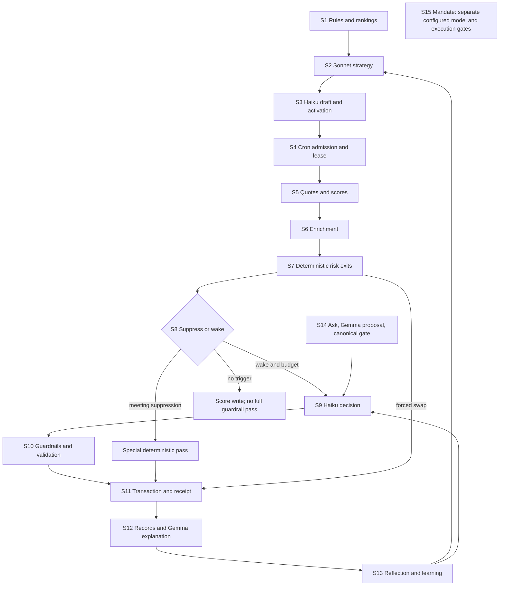

# Trading brain and Jev discovery — 2026-09-19

<!-- Part A was written before opening docs other than BUILD_RULES and applicable instruction files. Summary and Parts B-E are appended after reconciliation. -->

## §0 — For Flash

**Brain health.** The brain has useful guardrails, but its inputs and records need tightening before we can confidently judge how well it trades.

- **Fix the handoffs first.** A check can combine information from before and after a swap.
- **Protect the accounting.** Trimming old trade records can affect later score calculations; the frequency is unmeasured.
- **Make standing checks consistent.** Some exit checks depend on whether the decision loop wakes.
- **Measure character honestly.** Different instructions do not prove different behavior, and a forced exit is not lost personality.
- **Keep explanations grounded.** An agent should claim only evidence it actually received.

**Jev verdict.** Promising as a narrow explanation auditor; not yet justified as a trading decision-maker.

**First experiment.** Compare explanation checks using today's inputs, improved inputs with the current model, and those same improved inputs with Jev. Low false alarms, useful additional catches and substantially lower cost would justify a behind-the-scenes logging trial—not influence over trades.

## Session record

- Run date: 2026-09-19. Local `main` and starting HEAD: `5ba406615c90276dce7395187847c9f01d288f4a`. Branch created from that local main: `docs/astra-trading-brain-jev-discovery`. History is not shallow. No fetch: upstream freshness is UNVERIFIED under the requested no-network boundary.
- Scope: static code inspection and committed fixtures, then documentation reconciliation. No tests, scripts, installations, API calls, production reads, flag changes, commits or PRs. This report is the sole file created. Shared Git metadata required an approved filesystem escalation to create the requested branch.
- Instructions read: empty `.codex/AGENTS.md`, `CLAUDE.md`, and `docs/BUILD_RULES.md`. The user's code-first order and one-file/no-network boundary take precedence over general instructions to fetch, open other docs first, or copy reports outside the repo.
- Code coverage: deploy, battle cron and prompt assembly, risk/guardrail/execution/scoring paths, archetype ranking and identity, control projection and filing, narration and anticipation, capture/receipts/UI explanations, reflection, parallel Mandate path, flags, cron registrations and targeted fixtures. Data-provider internals, every newsroom producer, training/season orchestration, every legacy migration and every chat mode received less coverage; conclusions about them are bounded below.
- `[static]` means read at this HEAD, not observed in production. `[fixture]` means a committed assertion/snapshot was read, not executed. `VERIFIED` in this report means that limited source verification, never a passing test run. `UNVERIFIED` identifies an unresolved empirical or semantic question. Reachable means the code path can run with checked-in flags and its stated eligibility; it does not establish actual traffic or deployed configuration. Disabled means checked-in gate/registration prevents the stated path. Proposed means no implementation is claimed.
- The findings below were recorded before documentation reconciliation and retain `[code-first]`. Later additions carry `[from-docs]`. Illustrative traces are not claims that a particular trade occurred.

## Part A — code-first reconstruction

### Finding register

| ID | Severity | Finding and evidence boundary |
|---|---|---|
| F01 | High | [code-first] [static] One tick can mix a pre-exit portfolio/score array, a refreshed post-exit battle, and the prior persisted headline score. A transaction protects writes but does not make that decision packet coherent. `api/cron/agent-evaluate.js:805`, `:917`, `:1814`, `:3104`; `api/_utils/agentEvalPromptAssembly.js:1135`, `:1458`. |
| F02 | High | [code-first] [static] Equipped deterministic exits do not have one universal pre-model pass: a no-trigger return bypasses them, while meeting suppression has a special pass; LOCK also defers otherwise forced guardrail exits. `api/cron/agent-evaluate.js:1839`, `:1859`, `:1969`, `:2334`; `api/_utils/agentGuardrails.js:452`. |
| F03 | High | [code-first] [static] Evidence is asymmetric: rich technical candidate descriptions, thin held rows, missing technicals for newly added candidates, and identity obligations whose inputs are absent. “Received a snapshot later” is not “saw it before deciding.” `api/_utils/agentEvalPromptAssembly.js:1458`, `:1535`, `:1762`, `:1826`; `api/cron/agent-evaluate.js:975`, `:1107`; `api/_utils/buildTechnicalSnapshot.js:23`. |
| F04 | High | [code-first] [static] Retention is entangled with economics and identity: swaps retain 50 trades but the next tick sums those retained locked points; evaluation IDs derive from an array capped at 150 and eventually repeat. Scope/frequency in actual battles is UNVERIFIED. `api/_utils/agentSwapExecution.js:353`; `api/cron/agent-evaluate.js:908`, `:2187`, `:3104`. |
| F05 | High | [code-first] [static] Executable legality, prompted character and demonstrated character are different. Some strong archetype claims are prose, not post-selection gates; there is no observed full-battle character measurement in the inspected pattern logger. `api/_utils/archetypeScoring.js:81`, `api/agent/decide.js:1104`, `api/_utils/evalIdentityBlocks.js:99`, `api/_utils/battlePatternLogger.js:38`. |
| F06 | High | [code-first] [static] An interpretation can become the player's apparent evidence: Haiku prose reaches voice and reflection, and an echoed directive ID supports an “acted” receipt without establishing semantic compliance. `api/_utils/voiceLayerTradeNarration.js:161`, `api/_utils/agentReflectionUtils.js:319`, `src/screens/battleView/deriveReceipts.js:23`. |
| F07 | Medium | [code-first] [static] Degradation is uneven: held-price failure safely skips; missing candidate prices become zero; missing candidate regime can pass; guardrail exceptions preserve the model proposal; tool validation is shallower than the requested schema. `api/cron/agent-evaluate.js:764`, `:2138`, `:2375`, `:2391`; `api/_utils/agentEvalPromptAssembly.js:1495`; `api/_utils/agentSwapExecution.js:28`. |
| F08 | Medium | [code-first] [static] Sequential battles share a 290-second budget, yet a battle lock expires after 120 seconds and post-decision narration can extend work. This is a capacity and overlap risk, not measured starvation or duplicate execution. `api/cron/agent-evaluate.js:157`, `:351`, `:585`, `:2030`, `:3223`. |
| F09 | High | [code-first] [static] Current receipts can support some executed-pair replay, not universal decision reconstruction or every HOLD counterfactual. Exact prompts, contemporaneous alternatives and complete scoring history are not all in one durable record. `api/_utils/learning/captureReceipt.js:304`, `:383`, `:407`; `api/_utils/tickStamps.js:192`; `api/cron/agent-evaluate.js:1969`, `:3066`. |
| F10 | Medium | [code-first] [static] Controls reach the brain by different routes and have unequal proof: executable exits, soft instructions, canonical directive text and self-reported citations are not interchangeable. `api/_utils/projectActiveRules.js:66`, `api/_utils/controlPromptRenderer.js:121`, `api/_utils/directiveGate.js:139`, `api/_utils/agentGuardrails.js:601`. |
| F11 | Note | [code-first] [static] Protect the numerical rails: canonical scoring constants, transaction-time duplicate checks, quote admission, explicitly attributed forced exits and awaited best-effort capture. These are stronger foundations than another opinion. `api/_utils/agentScoring.js:20`, `api/_utils/agentSwapExecution.js:152`, `api/cron/agent-evaluate.js:764`, `api/_utils/learning/captureReceipt.js:420`. |
| F12 | Note | [code-first] [static] The Mandate is a separate portfolio decision path with configurable model identity, revision/age/drift gates and request envelopes; its current transport remains Anthropic-specific. It offers implementation patterns, not permission to change the battle decision seat. `api/_utils/mandateModelCall.js:53`, `:99`, `:150`; `api/_utils/mandateExecution.js:110`. |

### A1. End-to-end stages

All rows are `[code-first] [static]`. `D` = deterministic; model names identify model-driven parts. Persistence described here is what the inspected writer stores, not proof of a successful production write.

| Stage | Inputs → output; evidence | Kind; reachability | Persistence / what the player receives |
|---|---|---|---|
| S1 Deploy admission and projection | Agent, equipped documents, ranked stock universe, archetype weights and market/news context → projected rules and ordered candidates. `api/agent/decide.js:233`, `:377`; `api/_utils/projectActiveRules.js:66`; `api/_utils/archetypeScoring.js:108`. | D; reachable. Legacy vectors active; V2 disabled (`src/config/featureFlags.js:2054`). | Decision's customization snapshot and subsequent saved strategy; no independent proof of every rule's influence. |
| S2 Strategy | Ranked CSV, constraints, personality/rules/leans, summarized stories → Sonnet brief and shortlist. `api/_utils/agentPromptAssembly.js:37`, `:70`, `:239`, `:260`; `api/agent/decide.js:395`, `:408`. | Sonnet `claude-sonnet-4-6`; reachable normal deploy. | Brief and shortlist saved at `api/agent/decide.js:666`; missing tool uses ranked fallback (`:423`). |
| S3 Draft and activate | Brief + shortlisted rows + crypto + conditional institutional block → Haiku tiers/bench; validate, retry invalid portfolio once, deterministic fallback; validate activation prices. `api/agent/decide.js:489`, `:521`, `:552`, `:599`, `:820`; `api/_utils/agentPromptAssembly.js:200`. | Haiku then D; reachable. Prescribed tournament deployment bypasses both strategy calls (`api/agent/decide.js:1302`, `:1348`). | Two star, two core, three support slots, bench, thresholds, rules/config snapshots and score state (`api/_utils/agentBattleService.js:154`, `:204`, `:274`); player gets opening portfolio/rationale. |
| S4 Schedule, completion and lease | Active battles; process expired battles, market hours, oldest evaluation-start order → one battle at a time with a lease. `vercel.json:157`; `api/cron/agent-evaluate.js:239`, `:311`, `:351`, `:585`. | D; reachable each registered 15-minute invocation when eligible. CPU passive branch does not call Haiku (`:949`). | Lock timestamps, completion result, completion pattern log and reflection queue; invocation errors retained (`:384`, `:4574`). |
| S5 Mark and score | Held + bench/watchlist + CPU/macro quotes; entry/daily baselines and threshold history → per-asset scores and pending aggregate write. `api/cron/agent-evaluate.js:719`, `:739`, `:764`, `:805`, `:907`. | D; reachable; unusable required held/CPU quote aborts battle tick. | Score/history writes; nightly badge banking is separate (`api/cron/agent-daily-scores.js:130`). No position change from scoring. |
| S6 Enrich and classify | Held 5-minute data, original held/bench technical docs, rankings and market posture → VWAP/short SMA, hot bench, regimes, risk inputs. `api/cron/agent-evaluate.js:975`, `:1003`, `:1043`, `:1145`, `:1218`. | D; reachable legacy data path. New intraday collection/diagnostic/agent/risk flags are disabled (`src/config/featureFlags.js:2586`, `:2604`, `:2615`, `:2641`). | In-memory enrichment and selected watchlist/risk state; not an exact archived model packet. |
| S7 Risk exits before language | Score/risk state + archetype tempo + bench → emergency, VWAP, trail or stagnation swap, LOCK or HOLD. `api/cron/agent-evaluate.js:1283`, `:1407`, `:1429`; `api/_utils/agentRiskManager.js:115`, `:434`. | D; reachable. Emergency classes bypass the ordinary momentum hurdle; stagnation uses it. | Trade, risk status, source/reason, receipt and feed. Battle is refreshed after success (`api/cron/agent-evaluate.js:1814`), initial arrays are not rebuilt. |
| S8 Suppress or wake | Pending proposal/meeting, current triggers, news → early return or Haiku admission. `api/cron/agent-evaluate.js:1839`, `:1853`, `:1909`, `:1961`; `api/_utils/agentTriggerGate.js:20`. | D; reachable; legacy persisted proposal branches reachable conditionally, fresh ordinary copilot/manual proposal creation effectively disabled by forced autopilot (`api/cron/agent-evaluate.js:2410`). | Seen news IDs, meetings/proposals, timestamps. No-trigger return writes scores without a model evaluation or universal guardrail pass (`:1969`). |
| S9 Build packet and decide | Identity, rules/controls, previous strategy/learning, held rows, bench indicators, news and triggers → forced decision tool. `api/_utils/agentEvalPromptAssembly.js:340`, `:746`, `:1122`; `api/cron/agent-evaluate.js:2040`, `:2112`. | Haiku `claude-haiku-4-5-20251001`, temperature 0.4, output ceiling 2,048; reachable only if wake and time budget. `api/_utils/agentEvalTransport.js:48`, `:59`; `api/cron/agent-evaluate.js:2113`. | Model decision/rationale/hypothesis/claims/conviction and failure classification; full exact request is not retained by the standard evaluation writer. |
| S10 Apply checks and select actual action | Model result → equipped stop/trail/target overrides, sector check, LOCK and distressed veto, legal swap validation, momentum hurdle and tempo cap. `api/cron/agent-evaluate.js:2334`, `:2383`, `:2391`, `:2401`, `:2431`, `:2447`; `api/_utils/agentGuardrails.js:351`. | D; reachable. Diversifier-specific injected sector cap is observe, not enforce (`src/config/featureFlags.js:939`); equipped user's executable cap can still block. | Guardrail evaluations/override provenance and veto reasons; actual decision can differ from model output. |
| S11 Execute and capture | Chosen slot, incoming asset, quote map, metadata → transactional swap and post-swap capture. `api/_utils/agentSwapExecution.js:117`, `:152`, `:248`, `:353`; `api/_utils/learning/captureReceipt.js:374`, `:420`. | D; reachable; tournament pool reserve/confirm wraps it (`api/cron/agent-evaluate.js:1631`, `:1664`). | Portfolio, outgoing cooldown, trade ledger capped at 50, tradeCount, reset incoming thresholds; learning receipt on supported live-agent paths. |
| S12 Record and explain | Result, guardrails, score snapshot, prompt stamps → evaluations/feed/tape and voice/anticipation hooks. `api/cron/agent-evaluate.js:2869`, `:2998`, `:3104`, `:3223`; `src/screens/battleView/buildTape.js:100`. | D + Gemma voice; reachable in checked-in shadow grounding mode (`src/config/featureFlags.js:2271`, `:2322`). Anticipation lint disabled (`:2563`). | Evaluations capped 150, feeds 100 or 50, tick stamps only after prompt built; raw rationale and separate narration shown through UI. |
| S13 Learn and review | Completion outcomes + retained trades/evaluations → reflection, rolling memory and periodic consolidation; daily batch review → Haiku review then Gemma voice. `api/agent/reflect.js:96`, `:132`, `:153`, `:215`; `api/_utils/agentConsolidationApply.js:325`; `api/cron/agent-batch-review.js:207`, `:291`, `:382`. | Sonnet / Haiku / Gemma; reachable eligible paths. Settlement regret engine not located in inspected learning code; do not infer it exists from receipt fields. | Learning/insight, disciplines and lessons later fed into S2/S9; separate player review message. |
| S14 Player controls → S9 | Chat user ask + menu → Gemma proposal → canonical allowlist gate, optional one repair → single filed directive. `api/agent/chat.js:763`, `:843`, `:1009`, `:1080`; `api/_utils/directiveGate.js:139`, `:184`, `:339`. | Model interpretation then D gate; reachable legacy chat path. Literal fit-check disabled (`src/config/featureFlags.js:887`). Direct chip filing route disabled while grounding remains shadow (`api/agent/file-directive.js:172`). | Canonical text/ID/version/thread/expiry, original exchange, model echo in evaluation, UI receipts. S14 never directly executes a stock swap. |
| S15 Mandate parallel loop | Book + pinned vintage + snapshot → configured Haiku decision → gate → revision/age/price-drift guarded execution. `api/cron/mandate-evaluate.js:141`, `:166`, `:195`, `:216`; `api/_utils/mandateGate.js:59`; `api/_utils/mandateExecution.js:110`. | Model + D; master/evaluate/close reachable; direct transport active, rollover disabled (`src/config/featureFlags.js:1914`, `:1938`, `:1967`). | Durable request envelope and book decisions; different cash/size/position-count constraints, not BaggerBomb's fixed swap system. |

### A2. Who can change a position, and what wins?

All rows `[code-first] [static]`; the priority here describes actual control flow, not an endorsement of it.

| Action owner | Precedence, eligibility and effect | Durable attribution / limitation |
|---|---|---|
| Deploy draft / prescribed draft | Normal deploy's Sonnet shortlist → Haiku tiers; count/membership/duplicate validation and fallback. Prescribed league branch skips model construction. `api/agent/decide.js:552`, `:1104`, `:1147`, `:1302`. | Initial portfolio, strategy, selection rationale; exact model metadata uses friendly labels at `:675`, not always the requested full ID. |
| Risk engine | Runs before trigger gate. Priority: invalid data HOLD → bust avoidance → VWAP failure → near-bonus LOCK → stepped trail → stagnation → HOLD. `api/_utils/agentRiskManager.js:115`. Multiple queued swaps processed sequentially (`api/cron/agent-evaluate.js:1429`). | `source: risk_manager` or stagnation `archetype`, explicit reason, null hypothesis; technical captures and learning receipts (`:1584`, `:1750`). |
| Replacement selector | Same-asset-class candidates exclude active holdings and cooldown, then rank daily momentum; stagnation adds quality/hurdle predicate, emergencies do not (`api/_utils/agentRiskManager.js:434`; `api/cron/agent-evaluate.js:1477`, `:1494`). It cannot liquidate into cash: empty pool holds (`:1520`). | Forced exit means “attempt a permissible replacement,” not guaranteed sale. Ranking by momentum is shared across archetypes and does not itself implement a fundamental-quality gate. |
| Model proposal | SWAP must pass gates, conviction at least 70, hypothesis length, membership, duplicate/cooldown/type rules; ordinary momentum delta hurdle and rolling frequency cap. `api/_utils/agentSwapExecution.js:28`; `api/cron/agent-evaluate.js:2431`, `:2447`. | Model rationale, hypothesis, structured reasoning; self-reported intent and claims, not verified causes. Missing conviction can evade `<70` rejection if a malformed response gets this far; tool schema request is not runtime validation. |
| Equipped guardrail | Stop before trailing stop before enabled profit target; may override model HOLD or another swap. Sector checks run only on unforced proposed swaps; forced exits bypass that cap. `api/_utils/agentGuardrails.js:253`, `:289`, `:317`, `:351`, `:355`. | Evaluation records and forced source; missing bench or a locked outgoing position can defer. Distressed top replacement is subsequently blocked, without a search through the next candidate (`:529`; `api/cron/agent-evaluate.js:2391`). |
| LOCK | A positive near-next-threshold risk label; later model and guardrail swap checks defer it. Risk emergencies precede creation of LOCK. `api/_utils/agentRiskManager.js:128`, `:149`; `api/cron/agent-evaluate.js:2383`; `api/_utils/agentGuardrails.js:452`. | `[fixture]` `api/_utils/agentGuardrails.test.js:161` shows a locked breacher stays HOLD. Its artificial negative-LOCK combination is not proof a bust reaches that state; positive target/trail conflict remains structurally possible. |
| Player directive / lean / trait | Adjusts prompted preference; cannot name a direct executable swap through the directive slot. Canonical allowlist limits what is filed, not whether a selected stock honors it. `api/_utils/directiveGate.js:139`; `api/_utils/controlPromptRenderer.js:213`. | Text/ID/version/thread; echoed thread ID can generate “acted,” not a causal compliance certificate. |
| Legacy approvals | Previously persisted pending proposals can approve/expire into execution (`api/cron/agent-evaluate.js:3337`, `:3412`, `:3623`). Current eval forces autopilot (`:2410`), so do not describe new copilot proposals as today's normal mode. | Proposal status and resulting trade; pending proposal's early return skips the ordinary guardrail splice (`:1839`). |
| Gameplan meeting | Deterministically generated after loss patterns; approval iterates suggested swaps through reservation/executor (`api/cron/agent-evaluate.js:4134`, `:4186`, `:4357`, `:4440`). The inspected approval loop does not rerun the ordinary Haiku hurdle/cap sequence. | Meeting suggestion, approval and trade. While awaiting meeting, a special deterministic guardrail pass exists (`:1859`, `:3800`). |
| Threshold banking and daily reset | Score change, not holding change. Incoming swap resets incoming threshold history; daily close banks badges separately. `api/_utils/agentSwapExecution.js:306`; `api/cron/agent-daily-scores.js:130`. | Active plus retained closed-trade points plus accumulated banked badges; the badge accumulator does not compensate for dropped closed-trade locked points (F04). |
| Transaction | Rereads current slot, rejects self/duplicate incoming and prefers a fresh live-price beacon. It does not compare an expected outgoing identity/revision to the predecision snapshot. `api/_utils/agentSwapExecution.js:152`, `:169`, `:180`. | Closed trade uses actual outgoing asset. If overlapping workers changed the slot, stale reasoning could be attached to a different outgoing asset: possible by inspection, not observed. |
| Mandate | HOLD / BUY / SELL / TRIM / ADD; deterministic universe, cash floor, sector, single-name and count gates; revision/session/age/drift gates at execution. `api/_utils/mandateConfig.js:59`; `api/_utils/mandateGate.js:59`; `api/_utils/mandateExecution.js:110`. | Different product can retain cash and size positions. Do not transplant its action vocabulary into fixed-slot battle judgments. |

`[fixture]` Suppression-pass assertions cover successful stop/target execution with engine source, null hypothesis and one receipt, plus distressed/locked/empty-bench deferral (`api/cron/agent-evaluate.suppressionPass.behavior.test.js:128`, `:165`, `:178`, `:192`, `:208`). They establish intended helper cases, not universal invocation coverage.

### A3. What reaches the decision model

| Surface | Actual packet and omissions | Consequence |
|---|---|---|
| Held positions | Tiered CSV has 13 columns: tier, symbol, sector, entry descriptor, entry/current prices, gain, ATR multiple, badges, ATR%, lock value, next bonus and levels. Flat-six omits tier. Separate held regime and VWAP/width/NR7/range blocks. `api/_utils/agentEvalPromptAssembly.js:1458`, `:1762`, `:1826`. | No equivalent held raw RSI/MACD/relative-volume/RS technical block in this assembly. The model cannot reliably compare a current holding and candidate on all the same indicator dimensions (F03). |
| Bench | Six basic CSV columns, plus noncrypto technical renderings in eight groups: trend, momentum, volatility, volume, relative strength, levels, recent action and composite. Missing technical source omits fields; missing quote renders zero. `api/_utils/agentEvalPromptAssembly.js:1495`, `:1535`, `:1588`, `:1719`. | Candidate packets can be richer than held ones yet thinner for fresh hot-bench additions. `allTechSymbols` is fixed before additions (`api/cron/agent-evaluate.js:975`, `:1107`); ranking-only rows do not supply all missing raw technical values. |
| Quality | Fundamental mirror renders PE/PB, revenue growth, market cap, revisions, beat rate and surprise with availability/vintage markers; it does not expose the deploy-ranking `fundamentalScore`. `api/_utils/fundamentalsRender.js:96`, `:134`. | Analyst identity demands refusal below 40 and core above 70 (`api/_utils/evalIdentityBlocks.js:129`); the evaluation packet cannot apply those exact thresholds from these fundamentals alone. `[fixture]` `api/_utils/__dr13_snapshots__/buildEvalSystemPrompt.identityOn.analyst.snap.txt:5`; honest missing/vintage rendering in `api/_utils/__fundwire_snapshots__/fundamentalsBlock.on.snap.txt:1`. |
| Time and comparability | Header uses persisted `battle.scoreState`; rows use freshly calculated `assetScores`; later successful forced swap refreshes `battle`, not these arrays. `api/_utils/agentEvalPromptAssembly.js:1135`, `:1458`; `api/cron/agent-evaluate.js:1814`. | Score headline can lag even without a swap. After a swap, a pre-exit symbol can be rendered against a post-exit portfolio lookup. This needs an explicit same-tick rebuild before a judge gets any packet. |
| System obligations | Prompt describes multi-indicator setups, temporal recovery/cooling, strict distressed avoidance, hard constraints and directly displayed first-person rationale. `api/_utils/agentEvalPromptAssembly.js:415`, `:425`, `:467`, `:515`. It says only hard stops can override locks (`:439`), but implementation defers all forced guardrails on LOCK (`api/_utils/agentGuardrails.js:452`). | Language can demand unavailable temporal evidence or promise a precedence the code does not supply. Do not “verify” an absent indicator by asking a second model to infer it. |
| Learned/contextual text | Sonnet brief, original tier rationale, consolidated wisdom, last three evaluation excerpts (rationale 80 chars, hypothesis 60), control text and conditional institutional/news blocks. `api/_utils/agentEvalPromptAssembly.js:759`, `:775`, `:1247`, `:1279`, `:1389`. | These are compressed interpretations. Their presentation does not carry a uniform original-evidence lineage or uncertainty contract. News excerpts are not independently verified facts merely because another model read them. |

All six archetypes share these renderers. Identity blocks are capped at 1,050 characters (`api/_utils/evalIdentityBlocks.js:49`). A different persona is not a different evidence budget. The following numerical differences are implemented configuration, not measured behavior (`api/_utils/agentArchetypeConfig.js:37`, `:71`, `:100`, `:127`, `:156`, `:187`):

| Archetype | Prompted preference | Deterministic tempo / ordinary hurdle / stagnation |
|---|---|---|
| Trend Follower `momentum_chaser` | Name trend and sector momentum together. | 6 swaps/60 min; 0.35 ATR ordinary, 0.5 stagnation; 5 stagnation ticks. |
| Contrarian `contrarian` | Dislocation plus recovery/turn evidence, avoid chasing. | 4/60; 0.4 / 0.5; 6 ticks. Its config allows distressed consideration but the common eval veto blocks known distressed swaps (`api/cron/agent-evaluate.js:2391`). |
| Speculator `degen` | Volatility first; fundamentals excluded in legacy rank weight. | 12/60; 0.2 / 0.3; 3 ticks. |
| Capital Preserver `guardian` | Quality, low beta and patience. | 2/120; 0.5 ordinary; forced stagnation disabled. |
| Diversifier `diversifier` | Improve portfolio sector shape. | 4/60; 0.4 / 0.5; 6 ticks; archetype sector-cap injection observe, not blocking. |
| Fundamental Investor `analyst` | Quality thresholds and patient entry. | 4/60; 0.4 / 0.5; 6 ticks; quality thresholds remain prompt obligations in this eval path. |

`[static]` These configurations create distinguishable envelopes; identical envelopes for three archetypes do not prove identical choices. Deploy is different again: archetype ranking plus full Sonnet instructions feed a brief, whereas the Haiku draft call primarily sees the brief and ranked numbers (`api/_utils/agentPromptAssembly.js:37`, `:200`; `api/agent/decide.js:506`).

### A4. Two representative handoff traces

#### Ordinary swap, not an observed production example

| Hop | Facts that survive | Compression, added interpretation and uncertainty |
|---|---|---|
| Original data → S2 | `[static]` Ranked stock CSV carries FUND/TECH/BB_FIT/ATR_PCT/ARCH; stories carry reporter, headline and relative age. `api/_utils/agentPromptAssembly.js:239`, `:260`. | Full underlying filings, original calculation series and story evidence are not this packet. Sonnet turns rows and summarized news into a strategic brief (`api/agent/decide.js:408`). |
| S2 → S3 | `[static]` Brief and shortlist stock data; original shortlist order is replaced by ranked-stock ordering (`api/agent/decide.js:489`, `:506`). | Haiku receives Sonnet's interpretation rather than its full identity/control/news context. Missing Sonnet tool has a deterministic brief fallback, but the later consumer does not get a uniform per-claim provenance object (`:423`). |
| Live data → S9 | `[static]` Prices, entry/ATR/badges, candidate indicators, regimes, controls, selected news and old strategy/learning. `api/_utils/agentEvalPromptAssembly.js:1122`. `[fixture]` fundamental block preserves unknowns and vintage (`api/_utils/__fundwire_snapshots__/fundamentalsBlock.on.snap.txt:1`). | Mixed ages and F01/F03 limitations apply. Example claim “RSI is recovering” needs a provided trend/cross series or explicit trend flag; a single current RSI is not that evidence. A receipt's later raw technical snapshot cannot retroactively license the claim. |
| S9 → S10 | `[static]` Tool decision, pair, conviction, hypothesis, rationale, reasoning/citations. `api/cron/agent-evaluate.js:2138`, `:2303`, `:2334`. | Model inference becomes a proposed action. Arithmetic, membership and risk checks can reject it; no general semantic claim verifier checks that every rationale clause followed from supplied evidence. |
| S10 → S11 | `[static]` Legal pair and execution metadata; current transaction slot and execution price. `api/_utils/agentSwapExecution.js:152`, `:255`. | Price may come from a fresher beacon than the decision packet (`:180`). Actual outgoing symbol may differ if state changed. Snapshot/capture timestamps describe capture, not automatically source as-of or “seen by model.” |
| S11 → S12 | `[static]` Trade pair, recorded rationale/provenance, newly read market context, daily brief/cache and current directive. `api/_utils/voiceLayerTradeNarration.js:108`, `:161`, `:167`, `:195`. | Gemma receives Haiku's explanation plus another contextual read, not the full original decision evidence. Prompt tells it to stay faithful and not invent forced-exit selection logic (`api/_utils/voiceLayerPrompt.js:3601`, `:3603`, `:3666`); this is an instruction, not validation. An unsupported hypothesis can be repeated in an authoritative voice. |
| S12 → player / S13 | `[static]` Raw rationale/trade tape and separate voice; reflection sees retained outcomes, rationales and truncated hypotheses. `src/screens/battleView/buildTape.js:100`; `api/_utils/agentReflectionUtils.js:319`, `:327`; `api/agent/reflect.js:215`. | Reflection's correct/incorrect/inconclusive grades (`api/_utils/agentReflectionUtils.js:35`) are another model interpretation. Sonnet wisdom later re-enters S2/S9. Positive points do not prove the original justification. |

#### Directive-shaped decision, not a guarantee of influence

| Hop | Preserved meaning / constraint | Loss or overclaim risk |
|---|---|---|
| Player → Gemma | `[static]` Original chat text and archetype menu inform proposal (`api/agent/chat.js:763`). Menu examples include analyst quality/patience/catalyst adjustments (`src/data/archetypeAdjustments.js:232`). | This is natural-language interpretation. Candidate choice can be semantically wrong while syntactically on-menu. |
| Gemma → filing gate | `[static]` Proposal type and adjustment ID; deterministic allowlist provides canonical text/version/expiry. `api/_utils/directiveGate.js:139`, `:148`. Core-conflict, user-lever and research-only branches deliberately file nothing (`:144`). | Literal quote-fit check is disabled. One repair can fix an invalid proposal (`:184`, `:339`), while original visible reply is retained (`:242`): reply and repaired filing need not have identical meaning. |
| Filed record → S9 | `[static]` Single active directive slot with canonical text, thread ID and creation time; render asks model to echo ID if influenced. `api/_utils/directiveFiling.js:29`, `:50`; `api/_utils/controlPromptRenderer.js:213`. | Full original utterance, ambiguity, rejected alternatives and repair reasoning are not the directive block. Epoch suppression can remove it (`api/_utils/controlPromptRenderer.js:121`). A risk exit can occur before S9 even reads it. |
| S9 → action / receipt | `[static]` Thread echo and model reasoning are persisted (`api/cron/agent-evaluate.js:2815`, `:2869`); actual swap still passes S10/S11. UI derives filed/replaced/expired and acted receipt semantics (`src/screens/battleView/deriveReceipts.js:23`, `:78`). | Deterministic filing lifecycle is provable; substantive compliance is not established by the model echo. A forced risk exit should be excluded from discretionary character/compliance labels. |
| Action → Gemma/player | `[static]` Narration re-reads current directive (`api/_utils/voiceLayerTradeNarration.js:176`), which may have changed since decision. | The original directive/action association should be frozen from the decision record. Current-state narration can otherwise imply that the later instruction caused the earlier action. Grounded chip route is disabled today under shadow; its implemented on-mode behavior is not credited as live (`api/agent/file-directive.js:172`). |

### A5. Integrity at three different levels

| Level | Implemented evidence | What would constitute a valid test |
|---|---|---|
| Hard invariants | Transactional no-self/no-duplicate; asset-class/cooldown validation, threshold arithmetic, LOCK, common distressed veto, archetype hurdle/cap. Diversifier injected cap is observe. Fundamental deploy constraints are in prompt constants; draft validation checks structural portfolio validity, not all archetype constraints. `api/_utils/agentSwapExecution.js:28`, `:169`; `api/_utils/archetypeScoring.js:81`; `api/agent/decide.js:1104`. | Deterministic assertions and boundary fixtures. Reasking a model whether an already rejected duplicate was illegal measures neither character nor trading skill. `[fixture]` observe/enforce/user-cap/forced-exit distinctions in `api/_utils/agentGuardrails.test.js:798`, `:813`, `:838`, `:850`. |
| Discretionary preference | Distinct identity text, legacy archetype rank weights and some tempo settings; common replacement ranking and shared data shape. `api/_utils/evalIdentityBlocks.js:99`; `api/_utils/archetypeScoring.js:15`; `api/_utils/agentRiskManager.js:434`. | Matched, eligible choice sets with genuinely competing archetype reasons, original evidence and regime; label whether the stated tradeoff is faithful, not whether an action is stereotypical. Repeated identical choices only matter where frozen rubric predicts an informative difference. |
| Battle pattern | Logger stores active rules/bundles/preset/engagement/result/market regime; inspected fields do not compute turnover, holding-time distribution, exposure paths or causally adjusted concentration. `api/_utils/battlePatternLogger.js:38`. BaggerBomb fixed allocated slots offer no general cash decision (`api/_utils/agentBattleService.js:154`); Mandate does (`api/_utils/mandateGate.js:119`). | Compute exposures, holding periods and turnover from an uncapped event ledger; separate forced from voluntary exits, available alternatives, regime transitions and control epochs. Then review many eligible decisions. A declining guardian that exits forced risk is not drifting; a contrarian refusing unsupported distress can be faithful. |

`[code-first] [static]` F05 is a gap in enforcement and measurement, not a claim that the six agents have empirically converged. Quality thresholds need available quality data and an adjudicated definition of “hard” before being turned into gates. Common mathematical scoring is appropriate; uniform explanations pretending every risk exit expresses personality are not.

### A6. Controls: executable versus expressed

| Control | How it enters | Can compliance be established afterward? |
|---|---|---|
| Equipped rules and traits | Live projection chooses current trait/rule documents and parameters; deploy snapshots them; eval identity separates hard/soft text. `api/_utils/projectActiveRules.js:66`; `api/agent/decide.js:233`; `api/_utils/agentEvalPromptAssembly.js:783`. | Some guardrail types execute; a `hard` string alone does not. Stop, trailing stop and sector limit are classified executable, enabled target is executable, maximum position size is inapplicable to fixed slots (`api/_utils/agentGuardrails.js:410`, `:601`). |
| Standing leans | Resolved under directive priority; rendered as lower-priority text (`api/_utils/controlPromptRenderer.js:151`, `:231`). | No general per-lean semantic compliance test in inspected eval persistence. Model citations show what it reported, not all influential reasons. |
| Directive | Canonical ID/text and thread, expiry and epoch suppression (`api/_utils/directiveGate.js:139`; `api/_utils/controlPromptRenderer.js:121`, `:213`). | Filing and lifecycle provable; economic compliance needs explicit action evidence/rubric. Some menu text refers to concentrating/reducing position size, while the battle engine swaps fixed slots (`src/data/archetypeAdjustments.js:232`; `api/_utils/agentBattleService.js:154`): interpretation must respect available verbs. |
| Preset, exit dials, tempo | Risk preset/archetype configuration and enabled executable target feed S7/S10 (`api/cron/agent-evaluate.js:1313`, `:1325`; `api/_utils/agentGuardrails.js:317`). | Engine can record evaluated condition/override; absence of a swap may mean suppressed checks, LOCK or no replacement rather than ignoring a preference. |
| Watchlists/thesis | Equipped watchlist folds into deploy shortlist/hot bench; in-battle thesis context is read (`api/agent/decide.js:437`, `:621`; `api/cron/agent-evaluate.js:1255`). | Candidate inclusion is observable; thesis truth/causal influence is not established by inclusion. |

### A7. Degradation and skipped work

| Failure or absence | Behavior at HEAD | Evidence and honesty implication |
|---|---|---|
| Held/CPU quote unusable | Fail closed for entire battle tick, preserve prior score, release lock. | `api/cron/agent-evaluate.js:764`. Good score protection, but no normal evaluation record/feed entry is created by that return. |
| Candidate quote / macro missing | Bench formatter uses zero price/change; macro fallback zero. | `api/_utils/agentEvalPromptAssembly.js:1495`; `api/cron/agent-evaluate.js:777`. Missing must become explicit unknown, not neutral market evidence (F07). |
| Technical fetch fails | `Promise.allSettled`; absent VWAP session disarms corresponding risk signal; missing candidate regime can pass known-distressed veto. | `api/cron/agent-evaluate.js:978`, `:1013`, `:2391`. This is partial availability, not equally informed evaluation. |
| Fresh hot-bench candidate | Price fetched after original technical request set; fallback ATR can be ranking percentile × 8 or 2.5. | `api/cron/agent-evaluate.js:1107`, `:1145`. Synthetic defaults are not newly measured volatility or full technical evidence. |
| Too little time | Need 44 seconds reserved: build 10 + call 22 + post 12. `budget_skipped` without calling. | `api/cron/agent-evaluate.js:2030`. Record separately from deliberate HOLD and from model failure. |
| Prompt build timeout | Ten-second race; underlying asynchronous reads are not thereby cancelled. | `api/cron/agent-evaluate.js:2040`, `:2090`. No prompt stamp if build did not finish; do not include as fully observed reasoning. |
| Model timeout / unusable response | No SDK retries; SDK timeout 20 s, hard abort 22 s. Default HOLD and failure category/timing persist. | `api/cron/agent-evaluate.js:161`, `:2112`, `:2138`, `:2869`. Tool parser checks any tool-use with string decision, not full name/enum/shape. S10 can still replace fallback HOLD with a deterministic exit. |
| Guardrail throws | Catch and proceed with original model proposal. | `api/cron/agent-evaluate.js:2375`. A broken safety evaluator is fail-open relative to that layer, even though later legality checks remain. |
| Risk/forced replacement unavailable | Empty pool, locked outgoing or blocked candidate → defer with recorded reason; no cash liquidation. | `api/cron/agent-evaluate.js:1520`; `api/_utils/agentGuardrails.js:452`, `:510`, `:529`. “Stop reached” and “stop executed” must remain separate. |
| News-triggered failed call | Seen story IDs stored before model attempt. | `api/cron/agent-evaluate.js:1961`. That story may not re-wake a later tick after failure; other triggers still can. |
| Narration fails | Ten-second timeout/parse/empty response → no new voice message; trade remains. | `api/_utils/voiceLayerTradeNarration.js:195`, `:215`, `:236`. Correct fail-open for execution, but narrative availability differs from execution success. |
| Learning capture fails | Awaited create, duplicate-safe; invalid/failing receipt logged and trade unaffected. | `api/_utils/learning/captureReceipt.js:390`, `:420`. Appropriate execution isolation; cannot assume every trade has a receipt. |
| Reflection fails | Fallback reflection, rolling memory and periodic consolidation paths. | `api/agent/reflect.js:103`, `:132`, `:153`. Fallback/derived lessons must not be treated as adjudicated evidence. |

### A8. Capacity and overlap shape

`[code-first] [static]` The handler has 300-second maximum and a 290-second internal budget; eligible battles run sequentially in least-recently-started order (`api/cron/agent-evaluate.js:154`, `:158`, `:351`). Within one battle, quotes/technicals fetch concurrently (`:739`, `:978`), while risk swaps and battle processing are sequential (`:1429`). Per-battle shared ranking/context reads and repeated quote requests scale with battles, not only distinct symbols. Narrations are awaited in `finally` with no same 44-second admission check (`:3223`); anticipation is admitted only with more than 12 seconds remaining (`:3254`).

If average complete battle time is **t** seconds and pre-loop overhead **h**, an approximate per-invocation capacity is `floor((290-h)/t)`; this is an assumed planning formula, not a measured throughput. Example assumptions `h=10`, `t=5/10/20` yield 56/28/14 battles, before tail variability. Tenfold battles at fixed work per battle mean roughly tenfold demand; oldest-first ordering rotates service but cannot preserve 15-minute per-battle cadence when demand exceeds capacity. An extra one-second judgment on every processed battle directly reduces this budget unless run off the critical path. Actual battle counts and timing distributions are UNVERIFIED (Part E).

The 120-second lease is shorter than the handler budget; normal 15-minute schedule alone does not establish overlap, but retries/manual overlapping invocations after expiry could. No owner-token/expected-outgoing comparison protects the whole decision-to-write chain in the inspected battle path (`api/cron/agent-evaluate.js:585`; `api/_utils/agentSwapExecution.js:159`). Mandate's revision envelope is a useful comparison (`api/_utils/mandateExecution.js:110`), not evidence of a battle incident.

### A9. What can actually be reconstructed?

| Question | Present evidence | Limit and required assumptions |
|---|---|---|
| What executed? | Retained closed trade includes pair, tier/slot, entries/exits, locked points/gain, time/day, metadata and technical snapshots (`api/_utils/agentSwapExecution.js:255`). | Only latest 50 in battle document; receipt exists only if admitted and successful. Need append-only ledger and stable event ID for full history. |
| Why was it eligible? | Evaluation guardrails, triggers, source, rationale, risk state; capture predicate inputs and outgoing entry/ATR/history (`api/cron/agent-evaluate.js:2869`; `api/_utils/learning/captureReceipt.js:246`, `:308`). | F01 state mismatch, incomplete armed/level/high-water capture (`api/_utils/learning/captureReceipt.js:312`) and missing exact prompt prevent complete reproduction from all records. |
| What did model actually see? | Tick stamp evidence keys, held rounded values, candidate summaries and vintages (`api/_utils/tickStamps.js:87`, `:192`, `:252`). | Eight held evidence fields and five candidate fields are not an exact request. Newest source timestamp summarizes multiple symbols; quote/VWAP vintage can be just `tick` (`:267`). Capture's detailed snapshot has fields absent from prompt and may be fetched after execution. |
| Could it have held instead? | Outgoing entry/ATR/history + actual execution timestamp and subsequent market series could produce a paired one-step score. | Must freeze same horizon, tier/direction, score version, entry/daily baselines, accumulated threshold extrema/badges and price conventions; historical path is needed for crossed thresholds, not just terminal prices. Need subsequent outgoing and incoming marks from authorized archive/export. No production archive verified. |
| What if it chose another candidate? | Selected candidate and some anticipation summaries, not complete availability/cooldown/quality/source-age state. | Need the actual eligible set and synchronized marks, including candidates never selected. Rankings fetched later are not a counterfactual reconstruction. |
| What about HOLD or skipped ticks? | Some model HOLD evaluations and prompt-built stamps exist (`api/cron/agent-evaluate.js:2998`); no-trigger return has no equivalent evaluation (`:1969`). | Learning receipt gate is execution-oriented/live-agent-only (`api/_utils/learning/captureReceipt.js:383`). No universal archived opportunity set for “every decision.” A HOLD cannot be compared to an unspecified feasible swap. |
| Is the narrative true? | Stored claims, original chat exchange, captured source values for some claims, directive ID echo. | Outcome cannot label reasoning. Need exact shown evidence, atomic claim spans and independent adjudication; post-hoc recovered data cannot justify evidence the model never received. |

`[code-first] [static]` F04 needs direct attention: `trades.slice(-50)` in `api/_utils/agentSwapExecution.js:353` feeds a later `battle.trades` sum in `api/cron/agent-evaluate.js:908`; executor does not increment a separate lifetime locked-points accumulator. The nightly banked-badge accumulator is a different quantity (`api/cron/agent-daily-scores.js:130`). Once a nonzero old locked-points trade falls out, that retained sum changes; how often a battle exceeds the cap is UNVERIFIED. Likewise `evaluations.length + 1` at `api/cron/agent-evaluate.js:2187` stabilizes at 151 after the 150-entry cap (`:3104`), jeopardizing joins keyed only by eval ID (`src/screens/battleView/buildTape.js:100`). Do not claim universal replay until retention and identity are disentangled.

### A10. Verdict and priorities

**Protect:** a closed game with explicit scoring, deterministic ownership/duplicate checks, quote admission, forced-exit provenance, controllable flags and useful committed fixtures. `[fixture]` score preservation and separate banked badges are represented in `api/cron/agent-evaluate.goldenPath.test.js:113`, `:138`, `:159`; these were read, not run. Another model should never replace these rails (F11).

| Rank | Weakness / effect | First correction independent of Jev |
|---|---|---|
| 1 | F01 + F04: incoherent state and retention-linked score/IDs threaten decision quality and reproducibility before semantics. | One revisioned tick state; recompute after each mutation; cumulative score source and unique event identity independent of display retention. |
| 2 | F02 + F07: hard-check coverage and fail-open paths depend on entry route; “hard” can mean “checked only when awake.” | Explicit always-run deterministic evaluation phase, adjudicated LOCK precedence, typed unknowns and full tool validation. |
| 3 | F03 + F05: evidence parity and executable character do not match identity language; absent quality/temporal evidence invites invention. | Same evidence contract for held/candidate; explicit known/unknown and source age; decide which archetype constraints are truly hard and implement those in code. |
| 4 | F09 + F08: incomplete captures and shared budget make reliable evaluation/scaling harder. | Exact request/action linkage, eligible alternatives and skip outcomes; measure per-stage time and service coverage before adding calls. |
| 5 | F06 + F10: interpretations are recycled as explanations and learning; filing/echo can be mistaken for substantive compliance. | Freeze execution/control provenance, label claims as claims, let voice use only recorded supported facts, and keep outcome separate from reasoning labels. |

The brain has a useful deterministic skeleton and several distinct policy layers. Code alone does not establish that its discretionary choices are good, that personalities converge, or that another model improves returns. First make the evidence and action trail coherent, then measure a narrow semantic task the rails cannot answer. This is a code-first conclusion; Part B adds intended behavior without changing these findings.

## Part B — reconciliation with documented intent

Every note in this part is `[from-docs]`. “New” means not located in the targeted documents searched, not proof that nobody has reported it. Code-first observations above are retained even where a ruling changes their interpretation.

| Part A finding | Reconciliation | Intended behavior, discrepancy class and disposition |
|---|---|---|
| F01 — state coherence | **New specific combination** in this review. The earlier trace describes collection/score flow (`docs/audits/20260805_AGENT_ACTIVE_BATTLE_TRACE.md:23`); tick-stamp spec expects the in-memory rendered state (`docs/design/PHASE_B_TICK_STAMPS_SPEC_V1.md:22`). | No ruling authorizes mixed pre/post-swap evidence. A correctness gap relative to the stated evidence contract; do not label it a measured bad trade. Capture additions alone will not fix computation order. |
| F02 — check coverage / LOCK | **Documented in part, and clarified.** Earlier gameplan suppression defect: `docs/audits/20260816_EXIT_BEHAVIOR_TIER2_PHASE0_VERIFICATION.md:36`; R11 and preserved LOCK semantics: `docs/20260816_EXIT_BEHAVIOR_TIER2_FOUNDER_RULINGS_ADDENDUM_V1_1.md:15`, `:19`, `:35`. | Old description that meeting suppression prevents stops has been overtaken by the special pass. **LOCK deference is ruled behavior**, not an unauthorized exit-policy bug; the prompt's hard-stop exception is the conflicting description. No-trigger omission is a newly isolated coverage gap: it conflicts with the broad standing-order principle, while R11's concrete patch scope is meetings. Scope beyond meetings is an adjudication question, not a claim that R11 ordered an arbitrary precedence change. |
| F03 — packet asymmetry | **Documented.** Held RS omission is explicit in stamp erratum (`docs/design/PHASE_B_TICK_STAMPS_SPEC_V1.md:100`); fundamental-score omission and different surfaces are documented (`docs/audits/RANKS_ARCHETYPE_AUDIT_PHASE0_FINDINGS.md:148`, `:162`). | Bench evidence/story IDs were deliberately cut from stamps (`docs/design/PHASE_B_TICK_STAMPS_SPEC_V1.md:29`): not a violation of that storage spec. They remain prerequisites for broader claim/counterfactual promises. Held Levels were required and are now present (`docs/20260816_EXIT_BEHAVIOR_TIER2_FOUNDER_RULINGS_ADDENDUM_V1_1.md:26`; `api/_utils/agentEvalPromptAssembly.js:1482` [static]); do not repeat the old “no held resistance” defect. New-hot-bench missing technical parity remains a specific code observation. |
| F04 — retained scores / IDs | **Cap documented; consequences newly isolated.** Trade truncation appears in `docs/ARCHETYPE_MASTERY_DISCOVERY_REPORT_V1.md:288`; eval cap in `docs/audits/20260918_PHASE0_EVAL_CRON_SCALING.md:121`. | Neither citation establishes a lifetime accumulator or unique IDs beyond the cap. Treat the scoring dependency as correctness debt, and the ID collision as a conditional horizon/retention defect. No measured prevalence available. |
| F05 — character guarantees | **Documented, with a crucial qualification.** `docs/audits/RANKS_ARCHETYPE_AUDIT_PHASE0_FINDINGS.md:138` calls constraints prompt-only. Founder-approved `CONSTITUTION_FUNDAMENTAL_INVESTOR_V1.md:6`, `:23`, `:31` explicitly acknowledges that implementation and distinguishes discipline from a gate. | This is **not a hidden violation of a requirement that already promised a implemented gate**. It is an acknowledged constitutional aspiration/implementation gap, with old definition-language overclaim called out by the constitution itself. The eval identity still cannot apply a withheld score. Any mechanical quality policy requires founder adjudication/calibration, not an automated “repair” based on this audit. |
| F06 — explanation laundering | **Documented.** Grounding contract separates record from current context, forbids composing new rationale, retires trade narration and code-composes anticipation (`docs/design/VOICE_LAYER_GROUNDING_SPEC_V1_3.md:21`, `:28`, `:59`, `:67`, `:78`, `:85`). | Intended remedy already exists as a gated arc. Checked-in shadow mode leaves old narration reachable; that is an **activation gap**, not proof the intended contract is obsolete. Complete the existing measured rollout before adding a judge to narration that will be removed. |
| F07 — degradation | **Documented partially.** Transport build fixes the timer starting before prompt assembly and records failures (`docs/audits/20260912_BUILD_EVAL_TRANSPORT_HYGIENE.md:11`, `:12`, `:76`, `:167`). | Do not revive the fixed pre-build abort bug. Candidate zero/defaults, shallow schema checks and guardrail exception behavior are current observations; they need typed states and deterministic handling. New intraday work remains off, not a live remedy (`docs/audits/20260919_BUILD1_INTRADAY.md:17`). |
| F08 — scaling | **Documented.** Sequential budget, repeated reads and absent measured stage timing in `docs/audits/20260918_PHASE0_EVAL_CRON_SCALING.md:16`, `:17`, `:18`. | The Sep 18 “39 of assumed 40 cron slots” description (`:166`) is superseded by 41 checked-in entries (read count of `vercel.json`) and the newer contract's documented 100 limit (`docs/specs/INTRADAY_DATA_BUILD_1_CONTRACT_V1_1.md:27`). Platform limit is **documented, not reverified externally**. Do not base a scaling plan on the old one-slot arithmetic. |
| F09 — counterfactuals | **Discrepancy: design premise not satisfied by all current records.** Charter says every decision is computable, then specifies one-step, policy-level, settlement-time mining (`docs/AGENT_LEARNING_CHARTER_V1.md:23`, `:27`, `:32`, `:34`). | Charter is normative design, not superseded because code falls short. Treat universal replay as **an unmet prerequisite**, not a reason to weaken its arithmetic/partition rules. Closed rules make counterfactuals definable; they do not ensure the required historical inputs were retained. Exact divergent prompt capture can exist in a separate shadow corpus, but not all ticks (`scripts/PAIRED_EVAL_HARNESS_README.md:30`). |
| F10 — control proof | **Documented.** Heard means code rendered the directive, Acted uses model self-report, explicitly distinguished (`docs/design/PHASE_B_TICK_STAMPS_SPEC_V1.md:24`, `:98`). Advisory rules cannot alter risk values (`docs/ADJUDICATION_RULINGS_V1.md:118`). | Filing/Heard/Acted are existing limited claims. A semantic compliance score must not silently upgrade their meaning. Grounded route's on-only gate agrees with current amended contract (`docs/design/VOICE_LAYER_GROUNDING_SPEC_V1_3.md:97`). |
| F11 — numerical rails | **Documented governing rule.** Calibration fence and scoring concept fence (`docs/BUILD_RULES.md:12`, `:26`); arithmetic decides, language describes (`docs/AGENT_LEARNING_CHARTER_V1.md:27`); display derives from one source (`docs/BUILD_RULES.md:100`). | Preserve. Pure logging is not authority to change scorer calls or portfolio schema. New imported legacy archetype tables also trigger the separate import ratchet (`docs/BUILD_RULES.md:28`). |
| F12 — Mandate / model entry | **Documented plus partial implementation discrepancy.** D-23 model/provider config, D-24 Haiku battle boundary and D-25 evidence-led entry are in `docs/QUARTERLY_PORTFOLIO_RESTRUCTURE_CHARTER_V1_2.md:117`. | Sole-importer/config seam exists, but current wrapper creates Anthropic directly (`api/_utils/mandateModelCall.js:33`, `:41`, `:150` [static]); provider-agnostic execution is not complete. This is **partial fulfillment of a standing ruling**, not permission to swap battle models. This report does not challenge D-24. The requested archived-prompt, temperature-zero measurement discipline is preserved below. |

### Additional discoveries after Part A

- **F13 · Note · [from-docs] [static] League pre-draft has its own Sonnet call.** S3's prescribed deployment is model-free at that endpoint, but upstream league board production is not: `api/_utils/tournamentAgentBoards.js:369` produces a ranked board and `:528` persists it; orchestrator calls it (`api/_utils/tournamentOrchestrator.js:896`, `:1011`), then deterministic snake selection takes the first available name (`api/_utils/tournamentAgentDraft.js:115`). CPU boards use deterministic fallback (`api/_utils/tournamentAgentBoards.js:492`). This supplements A1 as **S2L**, reachable when the registered tournament lifecycle reaches draft; it prevents the misleading conclusion “league drafting has no model.”
- **Flowchart precision [from-docs] [static]:** A1 is a stage graph, not a return-stack trace. A risk swap invokes S11 and returns to S8 after refreshing the battle (`api/cron/agent-evaluate.js:1814`); it does not skip the rest of the tick by going straight to S12. A discretionary swap reaches S12 after S10/S11. S2L denotes the separately discovered league branch of S2, not an extra model call in ordinary BaggerBomb deployment.
- **Scoring precision for F11 [from-docs] [static]:** the inspected server scorer uses `priceChangePercent × 10 × tierMultiplier` for base points, then adds accumulated badge points and rounds the total (`api/_utils/agentScoring.js:270`, `:294`). Star/core/support multipliers are 2/1.5/1; badges remain flat: +15/+30/+50 at +1/+1.5/+2 ATR and −10/−20/−35 at −1/−1.5/−2 ATR (`src/constants/baggerBombScoring.js:33`, `:43`, `:56`). Threshold history can accumulate multiple badges (`api/_utils/agentScoring.js:77`). Entry-return scoring and badge baseline are distinct: swapped-in positions use swap entry; activation-day positions use their start; later unswapped positions use a validated previous close (`api/cron/agent-evaluate.js:823`, `:841`). Flat-six supplies an explicit per-asset multiplier override (`api/_utils/agentScoring.js:264`). This is why terminal price alone cannot reconstruct all scoring history.
- **F14 · Note · [from-docs] [static] Upstream data is not all model interpretation.** `compute-rankings` writes peer ranks (`api/cron/compute-rankings.js:1327`); `compute-index-intelligence` writes technical documents and stock ranking board (`api/cron/compute-index-intelligence.js:1243`, `:1524`). The daily regime *brief*, separately, uses Sonnet and persists date/model/sourceFailures (`api/cron/compute-daily-regime-brief.js:168`, `:204`). The stock/market regime classifier itself is deterministic (`api/_utils/agentRegimeClassifier.js:25`, `:68`). S6 must not be priced as a hidden model call; the brief feeding S12 is one.
- **F15 · Medium · [from-docs] [static] Existing experiment transport is a shape precedent, not a production adapter.** `scripts/experiments/jevDirectionJudge.js:66` requests an alias, `:287` makes data-collection denial optional, and `:319` records returned model but only loosely validates Choice strings. A new experiment must add strict snapshot/option/probability validation and mandatory policy settings for real text. Do not silently reuse this runner as the live trial implementation.
- **Coverage limit:** richer capture and the claims-first oracle/regime taxonomy are user-described in-flight work; their complete current design artifacts were not located among the inspected committed paths. No duplicate implementation is proposed. Exact packet/rubric ownership must align with those owners before Fable writes the experiment. The new intraday contract explicitly defers agent use and risk use behind paired gates (`docs/specs/INTRADAY_DATA_BUILD_1_CONTRACT_V1_1.md:38`).

### Jev evidence ledger — no new measurements in this audit

| Status | What can be carried forward | What it cannot establish |
|---|---|---|
| **Documented, supplied brief §2.3** | Typed Choice with option probabilities/confidence, ordinal Score with level probabilities/confidence, Noul yes probability; no prose generation. Input $0.042/M tokens, output free; 64k whole request and 32k state + longest question. Direct `jev-1.13.0`, direct 250k tokens/s and 1,200 RPM described as adjusting. | No current endpoint availability, production accuracy or numeric reasoning guarantee. No interpolation between Score levels. Direct limits are not OpenRouter limits. |
| **Documented, local transport; measured returned version** | Alpha Decisions path and `{model,state,questions}` shape in `scripts/experiments/jevDirectionJudge.js:63`, `:288`; report records returned `typesafe/jev-1.13-20260917` (`docs/audits/20260918_JEV_DIRECTION_JUDGE_EXPERIMENT.md:60`). | The request alias can move. Require expected returned snapshot and abort on mismatch; do not pool versions. Direct and OpenRouter identifiers are not interchangeable. |
| **Measured, committed reports** | Correct-filings 0/276 false alarms; near-neighbor 273/276 caught with either signal; real misses only 4 distinct cases, 9/12 caught; 108/108 obvious out-of-character judgments, 0/276 in-character false alarms; 261 repeated cases stable. `docs/audits/20260918_JEV_DIRECTION_JUDGE_ROUND2.md:25`. | Repeats are not independent cases; all on one day/snapshot, authored asks, not live trading. The real-miss row missed its numerical bar but was too small to bind. Ambiguous labels matter. |
| **Measured, scope clarification** | Round 2 says candidate pick and probability came from the **same call**; independent no-filing choice was a different subset (`docs/audits/20260918_JEV_DIRECTION_JUDGE_ROUND2.md:367`). | Do not attribute 98.9% to the later proposed two-call anti-anchoring architecture. The brief's one ambiguous 0.86-versus-roughly-50/50 example is **measured as supplied**, not evidence of general calibration. |
| **Measured, machine-specific** | Windows/OpenRouter p50 248 ms, p95 386 ms, max 1,036 ms, $0.068/1,000 judgments; Haiku $1.74/1,000 and 773/903 ms p50/p95 (`docs/audits/20260918_JEV_DIRECTION_JUDGE_ROUND2.md:347`). | These packets and desktop conditions do not price or time trading packets/Vercel. Approximately 26× cost advantage and 3× median speed are specific to that run. |
| **Documented limitations, supplied brief §2.3** | Literal questions, weak arithmetic, dates as text, multi-hop weakness, irrelevant-state dilution, adversarial content, conflicting criteria, no cross-question invariants, no generation. Vendor 70–500 ms is not application latency; headline 67.8% versus 74.1% is frontier-reference agreement. | Neither confidence nor agreement certifies truth. Choice/Noul thresholds do not transfer. An alias-only pin or dedicated spend key does not solve version/account-wide throughput risk. |
| **Open** | Vercel latency, numeric-heavy packets, real player text, OpenRouter effective limits; no-retention policy acceptance must precede real text. | No trading improvement or ability to replace Haiku established. All card costs/capabilities below are **assumed forecasts or proposed uses**, not measured outcomes. |

## Part C — what to simplify before adding a judge

### C1. Model-call inventory

Rows reference S-stages; code claims are `[static]`. Additional reads after the code-first checkpoint are `[from-docs]`. “Needs language” is an engineering judgment, not a model-performance measurement. External newsroom and research generation are out of scope internally; their prose is treated as an untrusted upstream input, not hidden proof.

| Call / reachability | Unique contribution and what it passes on | Keep, simplify or measure |
|---|---|---|
| Profile derivation — reachable API, upstream of S1; `api/agent/create-profile.js:146`, `:161`, `:182` [from-docs] | Three answers → archetype/config/personality/greeting; deterministic fallback archetype already exists. Generated personality can later enter strategy. | Mapping finite answers can be code; free-text personality/greeting needs generation. Do not pay a judge to repeat the mapping. Actual UI use was not traced. |
| S2 Sonnet strategy — reachable; `api/agent/decide.js:408` | Synthesizes archetype, context and user controls into brief + shortlist. Original structured rows plus interpreted strategy pass to Haiku. | Reasoning can matter; shortlist legality/count is code. Preserve explicit uncertainty/source IDs instead of expanding prose. No evidence that eliminating this call preserves quality. |
| S2L Sonnet board — reachable; `api/_utils/tournamentAgentBoards.js:369` [from-docs] | Ordered league preferences and own-user-pick stance, then deterministic available-name selection. | Similar reasoning to deploy but different exclusive-market choice; share evidence contract, not a misleading common action schema. CPU fallback has no model. |
| S3 Haiku draft and one validation retry — reachable; `api/agent/decide.js:521`, `:558` | Allocates permitted names into slot/bench structure with rationale. | Constraint feasibility and numeric rankings are code; relative allocation under competing preferences may need reasoning. Could compare deterministic constrained allocation offline; not remove a calibrated seat here. Retry is structural repair, not independent validation. |
| S9 Haiku eval — reachable on wake/budget; `api/cron/agent-evaluate.js:2112` | Balances evidence/preferences to propose HOLD/SWAP, hypothesis and candidates. | Retain pre-launch. Code owns numeric checks; avoid asking this same call to certify its own rationale. Fixed schema validation belongs outside it. |
| S14 Gemma chat + at most one proposal repair — reachable; `api/agent/chat.js:763`; `api/_utils/directiveGate.js:184` | Interprets ask and generates reply; canonical gate files. Repair returns an interpretation, not new original evidence. | Existing Directive Judge shadow trial owns the second-opinion seam. Do not redesign it here. Chip route needs no model and is disabled in current shadow mode. |
| Why/position debate — reachable API; `api/agent/debate.js:261`, `:279`, `:292` [from-docs] | Haiku reads current position/technical/directive/challenge data and returns argument, indicators, conviction and suggested action; response only at `:336`. | Fresh argument is not historical decision cause; label it accordingly. No execution authority in inspected endpoint. Grounded-record explanation may remove redundant causal storytelling. UI invocation coverage thin. |
| S12 deploy opener / repair opener — reachable conditional; `api/agent/decide.js:1598`; `api/agent/ensure-opener.js:73` [from-docs for repair route] | Gemma turns portfolio/record context into introduction; fallback template exists. | Generation supplies voice, not a trading judgment. Never let it invent a second rationale. |
| S12 trade narration — reachable while grounding shadow; `api/_utils/voiceLayerTradeNarration.js:86`, `:198` | Rephrases decider or engine cause with freshly read voice context. | Redundant source of unsupported causality; existing grounding on-mode retires it. C2 gets this gain without Jev. |
| S12 anticipation — reachable old voice branch; `api/_utils/voiceLayerAnticipation.js:167`, `:310` | Rephrases Haiku candidate/threshold with cached context. | Existing grounded branch uses deterministic event note. Stop generating another implied trading promise. |
| Daily regime brief → S12 — reachable registered cron; `api/cron/compute-daily-regime-brief.js:168`, `:204`; `vercel.json:177` [from-docs] | Sonnet summarizes market/calendar into themes and narrative; date/model/source-failures survive. | Numeric regime classification is already code; qualitative future-event interpretation differs. Label narrative as interpretation. No need for Jev to duplicate known dates or regime buckets. |
| S13 Sonnet reflection + fallback — reachable completion queue/endpoint; `api/agent/reflect.js:96`, `:215` | Outcomes and compressed decision explanations → reflection and hypotheses grades. | Outcome grade is not ground truth for reasoning. Reposition over mined facts when Phase B exists; do not make Jev an outcome oracle. |
| S13 Sonnet consolidation — reachable every fifth reflection; `api/agent/reflect.js:153`; `api/_utils/agentConsolidationApply.js:338` | Rolling reflections → disciplines, insight, evolution and lessons (`:271`). | Repeated compression can harden weak causal stories. Use evidence-linked lesson candidates and keep promotion deterministic. |
| S13 Haiku batch review + Gemma debrief — reachable eligible scheduled review; `api/cron/agent-batch-review.js:207`, `:291`, `:382` | Veto-price comparisons/trades → review; review → voice. | Compute comparisons in code; avoid relabeling price delta as game regret or soundness. Two language steps need separate purpose; grounded template can carry objective facts. |
| S15 Mandate configured decision — reachable direct; `api/cron/mandate-evaluate.js:195`; `api/_utils/mandateModelCall.js:150` | Book snapshot/vintage → typed sized verbs. | Reasoning under different cash/exposure constraints. Provider seam incomplete; Jev replacing its seat is a separate evidence/ruling question. Batch implementation exists but checked-in transport selects direct. |
| Season escalation/tiebreak helpers — automatic execution disabled by missing cron registration; `api/cron/season-daily-evaluate.js:35`, `:45`, `:49`; `vercel.json:149` [from-docs] | Parallel season pipeline has black-swan/tiebreak model hooks. | No automatic traffic assumed. Deep audit of direct/manual invocation and these calls is outside this report's main-loop coverage; do not count them in live cost estimates. |

### C2. Three highest-value changes with no new model

| Change | Benefit and unnecessary work removed | Fence contact / overlap / first bounded step |
|---|---|---|
| **C2-1 Coherent tick and durable action accounting** | One revisioned portfolio/score/input state; rebuild after mutation; reject stale outgoing/revision; separate cumulative economics and unique event identity from display-array caps. Persist exact request hash/text or a verifiable immutable reference, available alternatives, actual source ages and skip reason. Avoid fetching the same immutable batch context repeatedly. Fixes F01/F04 and enables F09; prevents paying to judge contradictory states. | `agentSwapExecution.js`, `agentScoring.js` and `agentBattleService.js`/battle shape are fenced, including caller-side scoring semantics. Handler-only capture can be fence-free if it adds no decision influence or forbidden top-level shape. Overlaps richer capture, single-score-source and intraday timestamp work; make one contract with those owners. First step: small deterministic regression design and capture/identity spec, not a sweeping generator redesign. |
| **C2-2 One explicit hard-check phase and honest evidence contract** | Every eligible tick checks standing deterministic conditions independent of language wake, with preserved ruled LOCK/replacement semantics; full tool schema validation; `unknown` distinct from zero; held/candidate parity, quality score and temporal facts only when actually available. Remove instructions to cite unsupported signals; record the reason checks could not run. No model computes freshness, legality or threshold arithmetic. | Moving calls can alter fenced risk/guardrail/scoring behavior; `agentGuardrails.js`, `agentRiskManager.js`, `agentEvalPromptAssembly.js`, and potentially `decide.js`/`archetypeScoring.js` need founder-gated review. Hard quality gates are a separate calibration decision, not assumed authorized. Overlaps exit dials, intraday staged use and the claims-first oracle. First step: adjudicate coverage and parity acceptance cases; do not change LOCK policy by accident. |
| **C2-3 Finish record-grounded explanation and evidence-led review** | Activate the already designed grounded pathway only after its existing measurements; remove redundant trade/anticipation paraphrase calls; freeze directive/provenance at decision; distinguish “rendered,” “self-reported influence,” “executed,” and “unable to evaluate.” Reflection proposes lessons over deterministic evidence, never upgrades narrative or P&L into truth. | Voice/capture/receipt/UI portions need no listed fence entry if decider behavior is unchanged; changing eval prompt obligations does contact `agentEvalPromptAssembly.js` and prompt registry rule (`docs/BUILD_RULES.md:30`). Overlaps voice grounding, capture and Learning Phase B almost exactly: complete them rather than launch a parallel rewrite. First step: reconcile activation readiness and record contract, then reuse existing rollout gates. |

### C3. Baseline against which Jev must earn its place

**Proposed, not built here:** a coherent revisioned tick; numeric/permission/freshness/exit checks in code; explicit unavailable evidence; matching held/candidate facts; durable event/score identity; a complete enough observation record to review decisions; Haiku retains the discretionary seat; voice quotes the recorded cause and learning consumes independently computed outcomes. C2 does not create new market knowledge or prove character. Jev receives **no credit** for fixing these input/record problems, computing existing predicates, removing narration calls already slated for retirement, or matching Haiku's self-description.

## Part D — does Jev add anything beyond that baseline?

All opportunities below are **proposed**. Jev suitability and forward cost/latency estimates are **assumed** unless explicitly marked documented/measured; every trading-quality effect is **open**. No card is an instruction to implement, flip a flag or access data during this audit.

### D1. Seam inventory

| Stage / seam | Typed judgment beyond C3? | Reason and boundary |
|---|---|---|
| S1 rank arithmetic, data availability, universe membership | **No** | Code already owns numeric ranking and eligibility. A cheap second number is not independent evidence (`api/_utils/archetypeScoring.js:108`). |
| S1 trait/rule compatibility and hard charter exclusion | **No for existing adjudicated cells; possible for new semantic proposals only** | Reuse canonical decisions; never reinterpret a ruled cell with Jev. New rule meaning would be a separate authoring tool, outside runtime authority (`api/_utils/projectActiveRules.js:66`). |
| S2 news/source → strategic claim | **Yes, conditional** | Check that a particular statement follows from supplied excerpts, not truth of the news or future price effect. J1 can generalize later; no full document available means insufficient evidence (`api/_utils/agentPromptAssembly.js:260`). |
| S2 strategy → S3 shortlist/allocation; S2L ordered board | **Yes, research only** | Check whether a reason/choice faithfully expresses a frozen archetype preference among legal alternatives; distinct from count/quality arithmetic. J2. `api/agent/decide.js:489`; `api/_utils/tournamentAgentBoards.js:369`. |
| S3 structural validation, prices, fallback construction | **No** | Slot counts, known symbols and baseline validity are deterministic (`api/agent/decide.js:820`, `:1104`). |
| S4 schedule, expiry, fairness, lease and budget | **No** | Times, concurrency and admission belong in code (`api/cron/agent-evaluate.js:351`, `:585`, `:2030`). |
| S5 scoring, thresholds, banking, quote freshness | **No** | Arithmetic and identity cannot be vouched for by a language judge (`api/cron/agent-evaluate.js:805`, `:908`). |
| S6 technical regime / market posture / source conflict | **No for current classifier; yes only for a separately authored qualitative claim** | Preserve exact four stock labels and three posture labels; missing evidence stays unknown. Do not replace the deterministic classifier or the user-described frozen taxonomy (`api/_utils/agentRegimeClassifier.js:25`, `:68`). |
| S7 forced exit / replacement legality / LOCK | **No** | Existing deterministic precedence, hurdle, cooldown and pool rules remain decisive. A judge must never delay a protective exit (`api/_utils/agentRiskManager.js:115`, `:434`). |
| S8 threshold/price/first/final-hour wakes | **No** | Already explicit conditions (`api/_utils/agentTriggerGate.js:25`, `:39`, `:51`). |
| S8 news-catalyst relevance or novelty | **Possibly yes, parked** | A semantic “material to this held thesis?” signal could augment existing ticker matching (`api/_utils/agentTriggerGate.js:153`), but needs original excerpts, frozen materiality rubric and false-skip study. Never let it suppress existing risk/required wakes. Not a top card because the current corpus cannot measure missed opportunities. |
| S9 decision seat itself | **No now** | Jev can choose a finite option but that does not establish policy quality, handle generated hypotheses, or satisfy D-24. Replacement would challenge a standing ruling and require full recalibration, not this experiment (`api/_utils/agentEvalToolSchema.js:14`; `docs/QUARTERLY_PORTFOLIO_RESTRUCTURE_CHARTER_V1_2.md:118`). |
| S9 independent discretionary preference comparison | **Yes, offline/shadow** | J2 asks a small, authored tradeoff question with feasible HOLD/SWAP alternatives; authority stays with Haiku + rails. |
| S9 reasoning/candidate text → S12 record | **Yes, strongest first test** | J1 checks semantic support after deterministic numeric/reference checks. It adds scrutiny of language, not a substitute calculation (`api/cron/agent-evaluate.js:2869`). |
| S10 rule precedence / sector / conviction / schema | **No** | Validate and execute in code. Character judgment cannot excuse an illegal trade (`api/_utils/agentGuardrails.js:351`; `api/_utils/agentSwapExecution.js:28`). |
| S11 reserve/execute/capture atomicity and provenance | **No** | Event/revision matching and numeric outcomes are code (`api/_utils/agentSwapExecution.js:152`; `api/_utils/learning/captureReceipt.js:420`). |
| S12 intent → executed action → explanation | **Yes for residual semantic overclaim** | Join identity/source/directive mechanically first; J1 can flag a sentence claiming unsupported causation. Do not resurrect narration C3 removes (`api/_utils/voiceLayerTradeNarration.js:167`). |
| S12 anticipation threshold | **No for numeric trigger matching; yes only for residual language entailment** | Current schema/lint/grounding contracts should remove impermissible promises; a Jev opinion cannot turn a future promise into a fact (`api/cron/agent-evaluate.js:2215`; `docs/design/VOICE_LAYER_GROUNDING_SPEC_V1_3.md:85`). |
| S13 settlement counterfactual / learning maturity | **No** | Deterministic one-step scoring and independence gates; Jev neither calculates regret nor promotes a lesson (`docs/AGENT_LEARNING_CHARTER_V1.md:27`, `:83`). |
| S13 lesson text → mined evidence | **Yes, later J1 reuse** | After Phase B exists, check wording against the exact distribution/qualification supplied; any number/date is precomputed. It may flag overclaim, not prove alpha. |
| Around S4–S13: battle-wide character | **Yes, lower confidence** | J3 can triage unexplained discretionary changes after code computes exposures/eligibility and separates forced actions. Metrics alone cannot fully read thesis/context (`api/_utils/battlePatternLogger.js:38`). |
| S14 directive interpretation and conversational intent | **Yes, already separately owned** | Reuse the existing Directive Judge trial and its independent-choice discipline; no fourth card or competing filing policy (`api/_utils/directiveGate.js:139`). |
| S15 Mandate | **Same semantic checks may transfer; decision-seat replacement no** | Separate packet/action taxonomy, model vintage and labels required. Cash/size/revision controls remain code (`api/_utils/mandateGate.js:59`; `api/_utils/mandateExecution.js:110`). |

**The inverse question.** Under the **assumption**, not established for trading packets, that judgments remain cheap and sub-second, it becomes plausible to inspect every eligible rationale clause or small discretionary comparison rather than a tiny manual sample, and to review every battle's character residuals without another long narrative. The product could expose “this reason lacks recorded support” or improve future evaluations from a broad failure census. Cheapness buys **coverage**; it does not buy truth. It does not make new price data available, solve missing HOLD opportunities, or justify more live trading calls inside an already constrained cron. A shared input state can amortize several atomic questions (**documented** capability); independent assessments must still be separate calls when revealing another model's candidate would anchor them.

### D2. Three full cards

#### J1 — Evidence-to-claim support audit

| Field | Design |
|---|---|
| Plain pitch | Catch explanations that say more than the agent's recorded evidence supports. |
| Seam | S9→S12, persisted rationale/reasoning/candidates at `api/cron/agent-evaluate.js:2869`; shown evidence at `api/_utils/agentEvalPromptAssembly.js:1122`; stamps at `api/_utils/tickStamps.js:192`. Later reuse for S13 lesson claims is conditional on Phase B. |
| Questions / options | **Choice**, one atomic clause at a time: “Using only the evidence marked shown_to_decider, what is the support status of this exact claim?” Proposed options: `supported` (all factual content entailed), `contradicted` (an explicit fact conflicts), `insufficient_evidence` (missing temporal/source/causal bridge), `not_factual` (preference or openly conditional hypothesis). Precedence: contradiction before insufficiency; split compound clauses before asking. No confidence interpreted as a probability of trading success. **New epistemic taxonomy proposed**, single future home `src/data/tradingJudgmentTaxonomy.js`; coordinate with claims-first oracle owner. Any setup/trading-specific acceptance criteria are Flash-authored, never inferred from Jev. |
| Packet fields and existence | `decisionId,battleId,source,decisionAt,rawClaim,span` from evaluation/trade (`api/cron/agent-evaluate.js:2869`; `api/_utils/agentSwapExecution.js:255`): IDs/text exist, robust globally unique ID and atomic span extraction prerequisite. `shownEvidence[] {sourceId,field,value,shown_to_decider,asOf,availability}` from actual rendered blocks (`api/_utils/agentEvalPromptAssembly.js:1458`, `:1535`, `:1179`): ephemeral today; exact snapshot/export prerequisite. `numericChecks,temporalComparisons,sourceAgeBucket` are **new deterministic preprocessing**; snapshot source is `api/_utils/buildTechnicalSnapshot.js:23`, but fields not shown are explicitly excluded from support. `origin` and `directiveThreadAtDecision` from recorded metadata, not later active slot (`api/cron/agent-evaluate.js:2480`, `:2815`). No P&L, future bars, model confidence, or proposed verdict in the independent packet. |
| Size / freshness | **Assumed** 500 tokens metadata + 2,500 relevant evidence + 500 claim/rubric + 500 question = 4,000 total; below documented 32k state+longest-question and 64k total. Reject oversize, never silently truncate. Code freezes visible rounding and compares timestamps, emits `same_session/fresh/stale/unknown` under an explicitly versioned contract; Jev receives those states, never adjudicates the clock. Facts outside the actual original request cannot justify its claim. |
| Trigger | Application code on every eligible captured model-produced factual claim, including HOLD. Not agent-callable. Offline first; later sample after persistence so exit execution cannot wait on it. |
| Authority | First stage **log only**, linked to immutable decision/claim/evidence/question version; no player badge, suppression, trading gate or self-repair. Later annotation needs a separate false-alarm bar and honest “support check,” not “verified truth.” No live re-ask proposed in this card. |
| Slow / down / garbage | Record `judge_unavailable`/invalid/timeout; do not default to supported. Trading and existing explanation behavior unchanged. No automatic retry in first experiment; bounded background deadline in any later design. |
| Fence contact | Offline exported-record runner: none, only source reads. Add capture after evaluation in handler: potentially fence-free if no prompt/action/schema semantics change. Better evidence in prompt contacts `agentEvalPromptAssembly.js`; action suppression would be a new behavior gate and requires adjudication. |
| Depends on | C2-1 exact shown-state lineage; C2-2 arithmetic/temporal prechecks; claims-first oracle ownership; C2-3 grounded explanation so it does not duplicate a retired voice call. Intraday use need not be enabled to test missing-evidence honesty. |
| Cost / latency | **Assumed** one call per eligible evaluation, several short claim questions share evidence: 4k input → `4,000 × $0.042 / 1,000,000 = $0.000168` (**documented price**, forecast applicability). In load scenario below: $0.17472/day at 100 battles, $1.7472 at 1,000; 2.67/26.67 average RPM during market hours, 40/400 one-minute tick bursts. No additional execution-path latency by design. Desktop/Vercel p95 on these packets **open**; earlier measured 386 ms is only an initial test hypothesis. |
| How it could hurt | Literal wording rewards vagueness; compound claims need multi-hop inference; raw numbers/dates tempt unsupported calculation; long packets dilute; rationale/player text may contain instructions; inconsistent definitions yield inconsistent answers; Choice and Noul would not share calibration. Candidate anchoring remains when a persuasive claim is shown: hide author/conviction/outcome, randomize equivalent wording and freeze independent evidence classification before seeing it. Do not pass Jev's label to the trader or optimize archetypes toward generic safe prose. Version drift or a green “verified” stamp would make honesty worse. No generation means code must explain labels from evidence links, not ask Jev for a new rationale. |
| Ground truth | Deterministic checks for explicit values, identity, source visibility and time ordering; Flash rubric for semantic entailment/causation, with ambiguous cases labeled insufficient or excluded before scoring. Known good/bad explanation mutations are useful but grouped with their source. Points/P&L are excluded: neither confirms that the information was present. |
| First step size | One offline experiment specification, then a separate bounded local runner written from Fable's executable prompt. No production flag necessary yet; successful results can justify a dark logging-only adapter, not activation. |

#### J2 — Independent archetype preference challenger

| Field | Design |
|---|---|
| Plain pitch | Learn whether the agent's voluntary choices express its own priorities when several legal options compete. |
| Seam | S9 after deterministic opportunity-set construction but independently of Haiku's answer; proposed comparison sidecar around `api/cron/agent-evaluate.js:2040`, with actual outcome recorded at `:2869`. S2L board comparison is a later separate stratum. |
| Questions / options | **Choice A, independent call:** “Under this frozen archetype preference rubric, which of these admissible alternatives has the strongest stated evidence, or is the evidence insufficient to distinguish them?” Option IDs are `HOLD`, `SWAP:<out>:<in>` generated from the validated set, plus proposed `insufficient_evidence` abstention; executable verbs derive from `api/_utils/agentEvalToolSchema.js:14`. No invented buy/short/size/cash action. **Choice B, separate call only after A is saved:** “Does the chosen action's stated tradeoff follow this archetype's priorities on the supplied evidence?” Proposed `faithful_tradeoff`, `contrary_tradeoff`, `insufficient_evidence`, `not_discretionary`; new labels live only in proposed `src/data/tradingJudgmentTaxonomy.js`. Flash owns the tradeoff rubric; analyst quality, contrarian turn evidence and guardian noise tolerance cannot be invented by the implementer. |
| Packet fields and existence | `archetype,identityVersion,applicableRules,controlEpoch,directive` from identity/control assembly (`api/_utils/agentEvalPromptAssembly.js:746`, `:783`; `api/_utils/controlPromptRenderer.js:121`): available text, pinned rubric version prerequisite. `alternatives,eligibilityReasons,forcedRiskActive` from S7/S10 (`api/_utils/agentRiskManager.js:434`; `api/_utils/agentSwapExecution.js:28`): callable predicates exist, **complete frozen set/counterfactual features not persisted today**. Matched per-symbol indicators/quality/relative changes/regime and known/unknown from S5/S6 (`api/cron/agent-evaluate.js:805`, `:975`, `:1235`): C2 parity prerequisite. Call A omits Haiku choice/rationale/conviction; call B adds actual choice/source and exact stated tradeoff. |
| Size / freshness | **Assumed** up to three concrete swaps plus HOLD; 1k rubric/control + 2k facts + 500 eligibility + 500 question = 4k per call. Code restricts admissible set, computes costs/exposure/ages and labels same-session validity. No “rank the whole universe” packet; 32k bound enforced. Comparing only three alternatives is a declared limited-choice test, not best-action certification. |
| Trigger | Code samples eligible discretionary model evaluations, including informative HOLDs. Forced stop/bust/VWAP/target exits and disabled-opportunity cases are excluded mechanically using source/reason (`api/_utils/learning/learningEnums.js:18`, `:74`), not by Jev. |
| Authority | **Log only** independent preference, actual action and disagreement. No majority vote, no trade veto, no live re-ask. A later routing policy would require a founder-authored threshold, evidence of incremental useful disagreements and separate calibration-fence approval. Legal authority always remains in deterministic gates. |
| Failure | Persist missing verdict, execute current Haiku + rails unchanged; never reinterpret unavailable as HOLD instruction. Call B omitted if A is unavailable rather than pooling anchored and independent cases. |
| Fence contact | Offline comparisons: none. Inserting a live extra decision policy affects calibrated behavior even from a non-fenced caller; `agentEvalPromptAssembly.js`, `agentRiskManager.js`, `agentGuardrails.js`, `agentSwapExecution.js` are possible fence surfaces. Export-only first step is fence-free. |
| Depends on | C2-1 complete opportunities and IDs; C2-2 parity and adjudicated constraints; J1 must establish claim support before a claimed reason becomes preference evidence; existing regime rubric and trading harness. No need to redesign Directive Judge. |
| Cost / latency | **Assumed** two sequential 4k calls per eligible eval → `$0.000336` per pair; scenario $0.34944/day / $3.4944 at 10×, 5.33/53.33 average RPM, 80/800 one-minute bursts. **Open** actual latency; two independent calls cannot use one shared-state request without losing the anti-anchoring separation. Keep both off execution path. |
| How it could hurt | A generic “safest trade” rubric makes all six archetypes converge. Selection anchored by option order, ticker familiarity or Haiku's rationale can masquerade as independent judgment; rotate option order and hide candidate in A. Numeric/date work stays code; multi-hop portfolio tradeoffs, diluted evidence, contradictory controls and hostile text are documented failure modes. No cross-question invariant: faithful tradeoff can differ from A's top choice; that is not automatically an error. Confidence is not calibrated regret. No generated alternative or thesis permitted. Version-specific thresholds only. |
| Ground truth | Flash labels informative cases under a written per-archetype rubric before seeing model arms, accepting multiple faithful actions. Hard constraints get deterministic labels, counted separately. One-step score is a separately computed outcome column only, never the preference label. Forced risk is not character drift. |
| First step size | Rubric and offline exported-opportunity study after J1; **not** the recommended first experiment. Dark logger only after evidence supports useful incremental disagreement. |

#### J3 — Battle-wide character review queue

| Field | Design |
|---|---|
| Plain pitch | Surface battles where the agent's voluntary behavior changed without an explanation in the recorded conditions. |
| Seam | Around S13 after completion, beside `api/_utils/battlePatternLogger.js:38`; consumes C2 event ledger, not the current capped array alone. |
| Questions / options | **Choice:** “After excluding forced actions and accounting for the listed opportunity and regime changes, which description is supported for this battle's discretionary behavior?” Proposed `consistent_preference`, `explained_adaptation`, `unexplained_change`, `insufficient_coverage`. Option precedence: insufficient coverage wins before substantive review. This is a **new trading taxonomy**, Flash-authored and versioned only in proposed `src/data/tradingJudgmentTaxonomy.js`, not a redefinition of regime labels. No continuous “character score” invented or Score-level interpolation. |
| Packet fields and existence | `archetype,controlEpochs,ruleVersions` from battle context/controller (`api/cron/agent-evaluate.js:607`, `:1348`); `events` from swaps/evaluations (`api/_utils/agentSwapExecution.js:255`; `api/cron/agent-evaluate.js:2869`); `regimeAtStart`/source tags exist (`api/cron/agent-evaluate.js:615`; `api/_utils/learning/captureReceipt.js:334`). **Missing prerequisites:** uncapped complete voluntary/forced history, skipped opportunities, regime-transition sequence, full available alternatives, source coverage. `turnover,holdDuration,sectorExposure,opportunityCounts` must be deterministic derived fields, not Jev calculations. Existing completion pattern logger alone is insufficient. |
| Size / freshness | **Assumed** 1k charter/control summary + 3k up to twelve selected opportunity episodes + 1k numeric bucket/coverage summary + 1k questions = 6k. Code chooses episodes under a frozen sampling rule and preserves totals so selection bias is visible; dates/order/coverage computed by code. Payload over cap or incomplete record yields insufficient coverage without a call. |
| Trigger | Application completion job after ledger finalization, at most once per battle/version; never requested by the agent and never on a sparse streak of successful trades. |
| Authority | **Log / internal review queue annotation only.** No player “out of character” badge, automatic retraining, lesson promotion, forced archetype change or strategy adjustment. Flash reviews evidence-linked examples. |
| Failure | No annotation; record unavailable/coverage deficit; existing completion/learning unaffected. Missing ledger is not normal character. |
| Fence contact | Offline reader/logger can be fence-free. Ledger/score repairs depend on C2 fenced work; any resulting control adaptation would re-enter existing founder-gated controls. No novel authority channel. |
| Depends on | C2 full ledger and truthful capture; J2 authored preference rubrics; Phase B denominator/independence discipline. Useful before regret mining only as a human-review queue, never proven learning. |
| Cost / latency | **Assumed** 6k input × $0.042/M = `$0.000252`/battle, $0.0252/day at 100 completed / $0.252 at 1,000. Spread over 60 minutes: 1.67/16.67 RPM; one-minute unsmoothed burst 100/1,000. Completion need not wait; actual latency **open**. |
| How it could hurt | Strongest multi-hop/dilution risk of the three. Sparse or selectively retained trades can manufacture drift; hindsight and the supplied label may anchor it. Adversarial narrative, contradictory charter text, calendar misreading and numerical patterns must be neutralized before input. It may reward generic low turnover and erase legitimate archetype differences. Return types cannot enforce logical consistency across a battery of questions; use one primary Choice, explicit abstention and no generated causal story. |
| Ground truth | Flash labels whole independent battles with conditions and eligible opportunities, blinded to identity of the judge and final score. Compute turnover/exposure exactly; adjudicate whether the *change* has a recorded reason. Winning is not faithful character and losing is not drift. Outcome can later stratify, never label. |
| First step size | Docs/rubric plus coverage census design; no runtime change. Lowest priority until the uncapped corpus exists. |

#### Shared cost and throughput assumptions

These are **assumed scenarios**, not “today's measured usage”: 100 simultaneously active battles (10× = 1,000), 26 regular-session opportunities/day, 40% reaching eligible discretionary evaluation, all six archetypes mixed. `100 × 26 × 0.4 = 1,040` eligible evaluations/day. The registered 15-minute schedule is code evidence (`vercel.json:157`); 26, 40% and the population are planning assumptions. A tick burst has 40 eligible evaluations (400 at 10×). Average per-minute calls = `calls per tick / 15`.

| Card | Today scenario / 10× daily calls | Today / 10× input tokens per day | Today / 10× input cost/day | 10× peak if released within one minute |
|---|---|---|---|---|
| J1 | 1,040 / 10,400 | 4.16M / 41.6M | $0.17472 / $1.7472 | 400 RPM; 1.6M tokens/min ≈ 26,667 tokens/s if smoothed |
| J2 | 2,080 / 20,800 | 8.32M / 83.2M | $0.34944 / $3.4944 | 800 RPM; 3.2M/min ≈ 53,333/s if smoothed |
| J3 | 100 / 1,000 | 0.6M / 6M | $0.0252 / $0.252 | 1,000 RPM; 6M/min = 100,000/s if smoothed |

**Documented comparison only:** each isolated minute fits below the supplied direct 1,200 RPM / 250k tokens/s limits; that does **not** establish OpenRouter headroom, and an instantaneous burst is not one-minute smoothing. J1+J2 together already reach 1,200 RPM at 10×, with **zero direct-limit headroom** before other account traffic; adding J3 yields 2,200 RPM. With no measured OpenRouter capacity, the safe planning conclusion is “queue and measure,” not “free capacity.” A dedicated key caps spend, not account throughput. First trial would run one card only with a low explicit request cap; drop/defer shadow work rather than trading work. C2's saved narration cost is not counted as a Jev benefit.

### D3. The strongest game-changer claim, then the case against

**Strongest honest version — assumed mechanism, open result.** J1 could turn explanation support from occasional manual review into a broad, evidence-linked census across swaps **and HOLDs**. After C3 supplies coherent records, a typed semantic judgment could find paraphrases, causal leaps and unobserved “recovering” claims that equality checks cannot. J2 could then make voluntary preference disagreements reviewable at scale, giving Flash examples where two lawful actions express different archetype priorities. J3 could make faithful adaptation distinguishable from drift across battles. The meaningful change is accountable personality and explanations, not a faster price forecaster. Evidence needed: low false alarms on real captured claims, incremental catches beyond deterministic checks and improved Haiku packets, and reliable labels on informative discretionary alternatives. Only J1 is ready for a small offline question now, conditional on obtaining the corpus.

**Strongest case against any Jev inside the brain.** A2 already has several independent action owners and precedence exceptions; another opinion risks creating a hidden policy layer. A7 shows data absence, unchecked schemas, uneven check coverage and tight service budgets; these are code problems, and Jev cannot repair them. A9 shows that many needed original packets/opportunities are not known to be archived; a convincing judgment over a reconstructed packet may be retrospective fiction. The existing grounding arc removes two explanation calls outright. An improved Haiku packet may perform equally well, while a typed judge adds transport, taxonomy, threshold and version maintenance plus correlated errors. If J1 only rediscovers missing-data checks code can perform, **do not integrate Jev at all**. D-24 remains untouched. The strongest responsible immediate position is an offline external auditor, not an in-loop gate.

### D4. Alternatives and a single shared design

| Card | Deterministic code | Restructured existing call | Current model with the same improved packet | Residual reason to test Jev |
|---|---|---|---|---|
| J1 | Exact numeric/source/citation/temporal checks, claim templates and explicit unknowns should handle most objective cases at zero inference cost. | Require evidence IDs beside clauses; make voice quote supported record fields. Self-citation is useful structure, not proof. | Haiku can separately classify the same atomic claim; provides the key quality comparator. It may be more reliable on complex interpretation and should win if the savings are marginal. | Only semantic entailment beyond these deterministic checks, at materially lower measured cost with comparable error rates. |
| J2 | Compute eligibility, quality/sector rules, marginal exposures and an explicit preference rank if Flash's rubric is fully formulaic. | Make Haiku enumerate the strongest alternative and evidence tradeoff in its existing tool result; extra structured reasoning may remove need for a challenger but remains self-report. | Independent Haiku on a hidden-candidate packet is a stronger same-model baseline than comparing Jev to the live agent's confidence. | Cheap disagreement coverage if Flash finds incremental, rubric-correct disagreements; no trading authority earned by agreement alone. |
| J3 | Full-battle metric dashboard, opportunity counts, conditional baselines and control/regime segmentation may suffice. | Sonnet reflection consumes those facts under a frozen character rubric instead of inventing causal lessons. | Haiku reviews the same short event packet; manual review remains the standard until stable labels exist. | Only reduced review cost for semantic residuals beyond the numeric dashboard; least evidence today. |

**Proposed shared architecture, once:** immutable C2 decision envelope → deterministic eligibility/claim splitting/arithmetic/freshness → versioned packet and question IDs → one bounded adapter → strict typed-result parser → append-only judgment record referencing the envelope. Envelope includes `battleId`, unique decision/event ID, source, rubric/question/packet/scorer versions, exact shown-evidence hash, provider/requested/returned model, dispatch/deadline/latency/usage/cost and disposition. Independent packets omit other models' choices; candidate-comparison calls are separate and linked. Do not store player credentials or unrestricted conversation histories.

The adapter may reuse the **shape** of `scripts/experiments/jevDirectionJudge.js:287`, not its optional privacy setting or loose parser. Validate exact keys, known options, finite 0–1 probabilities/confidence and distribution consistency with a documented tolerance; fail closed for the **judgment**, while product behavior stays unchanged. No silent provider/model fallback and no pooling snapshots. Store contradictions between questions as observations, never force a false consensus. Real player text requires accepted policy and no-retention routing. Any future integration is dark by default, reads its flag at call time and adds the off-state pin to the existing guard discipline (`src/config/flagPinGuard.test.js:58`). No new cron is required for an offline runner; later asynchronous hosting is a separate capacity design.

### D5. Ranking and one first experiment

Scores are **engineering judgments**, not measurements. Higher is better on every axis: value = valuable incremental effect; confidence = evidence it will work; cost-and-risk = inexpensive/low harm; fence contact = easy to keep outside the fence. Scores apply to the proposed logging-only first form.

| Card | Value | Confidence | Cost-and-risk | Fence contact | Rank |
|---|---|---|---|---|---|
| J1 | **4** — honest explanations beyond numeric checks matter to every player. | **3** — directive evidence supports narrow semantics, but trading entailment remains untested. | **4** — compact off-path calls; false assurance contained by no player badge. | **5** — exported-record experiment touches no fenced runtime. | **1** |
| J2 | **4** — measures discretionary identity where existing rails cannot. | **2** — rubric and complete opportunities missing; agreement is not quality. | **2** — two calls, anchoring and strong convergence risk. | **4** — offline is clear; useful live influence would cross the behavioral fence. | **2** |
| J3 | **3** — potentially useful reviewer queue, narrower player effect. | **1** — sparse history and multi-hop task undermine labels today. | **3** — cheap infrequent calls but high false-drift cost. | **4** — logger itself outside fence; truthful ledger depends on fenced prerequisites. | **3** |

**Recommend exactly one experiment: J1, “same evidence, supported claim?”** Fable writes the executable prompt/runner in a separate task. This is the design only. It is offline with respect to the product: local frozen files in, local JSONL/report out, no Firestore/EODHD/production writes or live trading. Model inference would use Flash's OpenRouter key set in that PowerShell window; no calls were made here.

| Design component | Frozen proposal |
|---|---|
| Question | Does Jev add reliable semantic support detection beyond deterministic checks, and is it materially cheaper than Haiku on the **same** improved evidence packet? No trade-selection or return claim. |
| Current-product baseline | Today's evaluation retains unverified model rationale/claims (`api/cron/agent-evaluate.js:2869`); no general claim-support judge exists. Record its emitted unsupported-claim rate under human labels. Do not manufacture a “supported” label just because the current product emits a sentence. Existing numeric/ID/lint checks are a separate deterministic baseline. |
| Three comparison arms | **A:** pinned Haiku, current assembled evidence packet, same frozen claim-support question. This is an *offline diagnostic of current inputs*, not a falsely claimed existing production judge. **B:** same pinned Haiku, same question, improved compact packet separating actual shown evidence, computed facts and unknowns. **C:** pinned Jev Choice, exactly B's state/rubric/options. A→B estimates packet benefit; B→C estimates model difference. Original product output is scored descriptively alongside these three arms. Use frozen original claims across all arms; do not let each arm choose easier claims. |
| Versions / sampling | Haiku uses the dated trading snapshot `claude-haiku-4-5-20251001`; OpenRouter canonical mapping and returned provider/model must be verified by a budgeted probe, following the existing mapping precedent (`scripts/experiments/jevDirectionJudge.js:73`). Request exact dated Jev identifier if accepted; otherwise request documented alias but **require returned `typesafe/jev-1.13-20260917`**, abort on unavailable/mismatched snapshot. No substitution by a newer release. Haiku temperature 0, fixed output budget. Jev's inspected Decisions shape exposes no verified temperature field: record “not exposed,” do not invent an unsupported parameter or claim it was set to zero. Pin packet/rubric/option order seed and transport settings. |
| Real data writer and availability | Standard source: evaluations at `api/cron/agent-evaluate.js:2869`, final write `:3201`; trade records at `api/_utils/agentSwapExecution.js:255`; receipts at `api/_utils/learning/captureReceipt.js:407`; stamps at `api/_utils/tickStamps.js:192`. These are **remote writers, not an on-disk corpus**. Exact full prompt variants can be written on divergence by `api/_utils/shadowAssemblyCapture.js:237`, `:258`, but assembly shadow is off (`src/config/featureFlags.js:1482`) and the harness warns identical ticks have hashes only (`scripts/PAIRED_EVAL_HARNESS_README.md:30`). `shadowLogger` is best effort and optional, not proof of capture (`api/_utils/shadowLogger.js:25`, `:44`). A separately authorized owner export is required; this audit neither obtains nor requests production access. |
| On-disk floor | Committed prompt/fundamental snapshots and `api/_utils/__fixtures__/controlsPromptFixtures.js` exist; `scripts/paired-eval-harness.js:76`, `:214` uses synthetic inputs. They support dry-run shape checks and curated adversarial examples, **not** a production efficacy bar or independent battles. Do not rerun the existing Firestore-backed harness as a shortcut. If adequate authorized archival packets do not exist, stop at fixture feasibility and report **corpus insufficient**; capture must precede adoption evidence. |
| Dataset and independent split | Target **120 original decision contexts from at least 12 separate trading days**, covering all six archetypes, HOLD/SWAP, missing/old data and forced-origin explanation controls. Use 6 days for development and 6 disjoint later days held out, 60 contexts each. Entire battles spanning the boundary are excluded or assigned wholly to one side before selection; no battle, original claim, paraphrase or mutated child crosses the split. Keep connected examples grouped. If market/regime diversity is too thin, report that limit; 120 contexts do not become 240 independent cases by mutation. |
| Cases | For each context, one primary atomic factual claim, plus at most one minimally changed near-neighbor/unsupported version: up to **240 case packets**. Independently select and freeze the claim span; avoid mining only obvious model mistakes. Include scalar controls, unsupported temporal “recovering” claims, source-time substitution, wrong indicator attribution, hypothetical-vs-factual distinction, and persuasive/adversarial text. Actual original claims and authored mutations have separate metrics. No text absent from the original prompt is promoted to “shown” in B/C. |
| Labels | Code labels explicit symbol/value/source visibility/date comparisons. Flash labels semantic entailment with: supported only if every factual component follows; contradicted only on explicit conflict; missing temporal/causal bridge = insufficient; pure preference/conditional = not factual. Preserve an evidence citation and short label rationale for each. Label blind to model output and realized returns; freeze disputed cases as ambiguous before scoring, report their count. Haiku is a comparator, never a label. Future points/P&L excluded entirely. |
| Development policy | Before any held-out call, freeze packet builder, claim selection, labels, exact rubric, options and flag rule in a hashed manifest. Primary flag = Choice is contradicted or insufficient; **no probability tuning** in first pass. Confidence is diagnostic only. If dev results motivate a different rule, version it and freeze it before untouched held-out data; no threshold transfer from the directive Noul experiment. Keep a small predeclared wording/option-order perturbation subset and group repeats with the parent. |
| Windows execution / spend | Separate proposed Node runner, invoked from PowerShell, reads explicit local dataset path and `OPENROUTER_API_KEY` from the window. No service-account environment use, product imports with side effects, logs of secrets or product writes. Dedicated key hard cap **$15**, plus local reserve-before-dispatch spend ledger; at most 800 requests including probes/declared repeats, concurrency 2, max 30 RPM, no automatic retries. Reserve worst-case per-call cost under the provider's probe-verified pricing/max tokens before dispatch; missing cost, cap uncertainty, budget exhaustion or version drift stops the run. At 240 cases, base is 480 Haiku + 240 Jev calls; Jev 6k upper input estimate gives `240×6,000×$0.042/M = $0.06048` (**assumed forecast**). Haiku forecast uses verified probe pricing before run, not the old $1.74/1,000 narrow-packet rate. No new script created in this task. |
| Privacy / payload | Use synthetic text or anonymized exported records under accepted policy. Real player utterances are optional and excluded unless no-retention routing is available and accepted; no calls with the experiment helper's default data-collection setting. Cap complete request conservatively before dispatch; longest state+question must stay under documented 32k and total under 64k. Missing original evidence is a data failure, never patched by contemporary retrieval. |
| Pre-run pass bars | On held-out **original** supported claims, false alarms ≤5% overall and ≤12.5% for every archetype with at least 8 eligible originals; otherwise that archetype is unproven. On held-out labeled unsupported/contradicted originals and mutations, report separately: catch ≥90% overall and ≥85% on predeclared near-neighbor subset. C no worse than B by >5 percentage points on either primary rate. Objective numeric/identity controls must be 100% correct after deterministic preprocessing; no incremental Jev credit for those. Valid/available responses ≥99%; invalid responses count as failures, not correct abstentions. Desktop p95 ≤1,000 ms; max and tails reported. C's actual cost ≤20% of B's for the same packets. At least 10 held-out semantic catches not already flagged by deterministic checks are required to claim incremental value. |
| Stability / harms bars | Predeclared ≤20 parent cases get one wording/order perturbation each per relevant arm within the request/spend cap; ≥95% verdict stability, with no prompt-injection string causing an otherwise explicitly contradicted claim to be accepted as supported. No return/outcome, model-author prestige or Haiku confidence in packets. Report every unsupported→supported perturbation rather than only the average. |
| Reporting and kill result | Give case counts, unique contexts/days/battles, confusion matrices, abstention/failure rates, per-archetype slices, paired disagreements, original-versus-mutation results, costs and p50/p95/max latency. Provide day-cluster uncertainty intervals, explicitly exploratory with only six held-out days; repeated judgments are not independent. **Kill or defer** if no complete corpus, insufficient labels, false-alarm/catch/stability bar fails, deterministic rules explain all value, or B is materially better without meaningful C savings. Do not rescue a failed held-out run by tuning on it. |
| What passing permits | Only a separately designed **dark, logging-only** J1 capture/adapter trial with no trade influence and a Vercel latency/account-throughput measurement. No production activation, verified badge, decision-seat swap, automatic lesson promotion or broad archetype judgment. A fixture-only pass permits only better corpus collection. |

Outside the trading brain (no more than three): a citation-to-excerpt entailment audit for authored research; ambiguous conversation-intent triage before expensive research; documentation-claim consistency checks against supplied source excerpts. All are proposed semantic tasks, not new commitments, and none bypasses accepted data policy.

## Part E — questions that would change the recommendation

1. Is there an owner-authorized archive/export with exact decision prompts and source vintages covering at least twelve independent trading days, including HOLDs?
2. Does the standing-order ruling require stop/target checks on every eligible tick even when no model wake occurs?
3. Which archetype constraints, especially the analyst quality floor, should become deterministic admission gates rather than prompted discipline?
4. Who owns the richer capture and claims-first oracle contracts, and can this experiment use their frozen schema/rubric instead of creating a parallel one?
5. What are the observed peak eligible battles, per-stage tick times and maximum retained-history requirements for launch modes?
6. Can the experiment use a strictly pinned OpenRouter snapshot with accepted no-retention routing and a $15 hard spend cap, or must it remain synthetic/local-label-only?

## Appendix — evidence index and audit boundary

Code anchors below were read; fixtures were inspected, not executed. Later findings remain `[from-docs]`. The core register's severity is unchanged; Part B supplies intent and qualifiers, including the ruled LOCK behavior and acknowledged prompt-only quality discipline.

| Finding | Primary current code / fixture | Reconciliation evidence |
|---|---|---|
| F01 High | `api/cron/agent-evaluate.js:805`, `:917`, `:1814`, `:3113`; `api/_utils/agentEvalPromptAssembly.js:1135`, `:1470` | `docs/design/PHASE_B_TICK_STAMPS_SPEC_V1.md:22`; specific mixed-state gap newly isolated. |
| F02 High | `api/cron/agent-evaluate.js:1839`, `:1859`, `:1969`, `:2334`; `api/_utils/agentGuardrails.js:452`; `api/cron/agent-evaluate.suppressionPass.behavior.test.js:128` | `docs/20260816_EXIT_BEHAVIOR_TIER2_FOUNDER_RULINGS_ADDENDUM_V1_1.md:15`, `:35`. |
| F03 High | `api/cron/agent-evaluate.js:975`, `:1107`; `api/_utils/agentEvalPromptAssembly.js:1458`, `:1535`; `api/_utils/fundamentalsRender.js:96` | `docs/audits/RANKS_ARCHETYPE_AUDIT_PHASE0_FINDINGS.md:148`; `docs/design/PHASE_B_TICK_STAMPS_SPEC_V1.md:100`. |
| F04 High | `api/_utils/agentSwapExecution.js:353`; `api/cron/agent-evaluate.js:908`, `:2187`, `:3104`; `src/screens/battleView/buildTape.js:100` | `docs/ARCHETYPE_MASTERY_DISCOVERY_REPORT_V1.md:288`; economic/ID consequences newly isolated, prevalence unmeasured. |
| F05 High | `api/_utils/archetypeScoring.js:81`; `api/agent/decide.js:1104`; `api/_utils/evalIdentityBlocks.js:99`; `api/_utils/battlePatternLogger.js:38` | `CONSTITUTION_FUNDAMENTAL_INVESTOR_V1.md:6`, `:23`; `docs/audits/RANKS_ARCHETYPE_AUDIT_PHASE0_FINDINGS.md:138`. |
| F06 High | `api/_utils/voiceLayerTradeNarration.js:161`; `api/_utils/agentReflectionUtils.js:319`; `src/screens/battleView/deriveReceipts.js:23` | `docs/design/VOICE_LAYER_GROUNDING_SPEC_V1_3.md:59`, `:78`; current mode `src/config/featureFlags.js:2271`. |
| F07 Medium | `api/cron/agent-evaluate.js:764`, `:2138`, `:2375`, `:2391`; `api/_utils/agentSwapExecution.js:28` | `docs/audits/20260912_BUILD_EVAL_TRANSPORT_HYGIENE.md:12`, `:76`. |
| F08 Medium | `api/cron/agent-evaluate.js:157`, `:351`, `:585`, `:2030`, `:3223` | `docs/audits/20260918_PHASE0_EVAL_CRON_SCALING.md:16`; old cron ceiling superseded by `docs/specs/INTRADAY_DATA_BUILD_1_CONTRACT_V1_1.md:27`. |
| F09 High | `api/_utils/learning/captureReceipt.js:304`, `:383`, `:407`; `api/_utils/tickStamps.js:192`, `:252`; `api/_utils/shadowAssemblyCapture.js:237` | `docs/AGENT_LEARNING_CHARTER_V1.md:23`, `:32`; `scripts/PAIRED_EVAL_HARNESS_README.md:30`. |
| F10 Medium | `api/_utils/projectActiveRules.js:66`; `api/_utils/controlPromptRenderer.js:121`, `:213`; `api/_utils/directiveGate.js:139` | `docs/design/PHASE_B_TICK_STAMPS_SPEC_V1.md:24`, `:98`; `docs/ADJUDICATION_RULINGS_V1.md:118`. |
| F11 Note | `api/_utils/agentScoring.js:20`; `api/_utils/agentSwapExecution.js:152`; `api/_utils/learning/captureReceipt.js:420`; `api/cron/agent-evaluate.goldenPath.test.js:113` | `docs/BUILD_RULES.md:12`, `:26`, `:100`; `docs/AGENT_LEARNING_CHARTER_V1.md:27`. |
| F12 Note | `api/_utils/mandateModelCall.js:33`, `:53`, `:99`, `:150`; `api/_utils/mandateExecution.js:110` | `docs/QUARTERLY_PORTFOLIO_RESTRUCTURE_CHARTER_V1_2.md:117`. |
| F13 Note | `api/_utils/tournamentAgentBoards.js:369`, `:492`, `:528`; `api/_utils/tournamentAgentDraft.js:115`; `api/_utils/tournamentOrchestrator.js:896` | Additional league-path read after Part A, not retagged code-first. |
| F14 Note | `api/cron/compute-index-intelligence.js:1243`, `:1524`; `api/cron/compute-daily-regime-brief.js:168`, `:204`; `api/_utils/agentRegimeClassifier.js:25` | Additional producer/model boundary read after Part A. |
| F15 Medium | `scripts/experiments/jevDirectionJudge.js:66`, `:287`, `:319` | `docs/audits/20260918_JEV_DIRECTION_JUDGE_EXPERIMENT.md:60`; `docs/audits/20260918_JEV_DIRECTION_JUDGE_ROUND2.md:12`, `:347`, `:367`. |

Final audit limits: no performance or incident frequency measured; no passing tests claimed; no production corpus proved available; no provider claims refreshed via network. Identical aggregate scores can sometimes survive a same-price swap despite stale components, so F01 is a state-coherence defect, not a claim that every swapped tick has an incorrect total. F04's effects require exceeding retention limits; existing short modes may never reach the evaluation-ID limit. These qualifiers narrow the findings without granting universal replay or economic correctness beyond what the writers preserve.

Deliverable verification: branch and HEAD match the session record; Git status contains exactly this one untracked report and no modified tracked files. Referenced file paths and full path:line anchors were checked for existence/range; report has no trailing whitespace. This is static document verification only, not a test run or validation of the proposed experiment.
