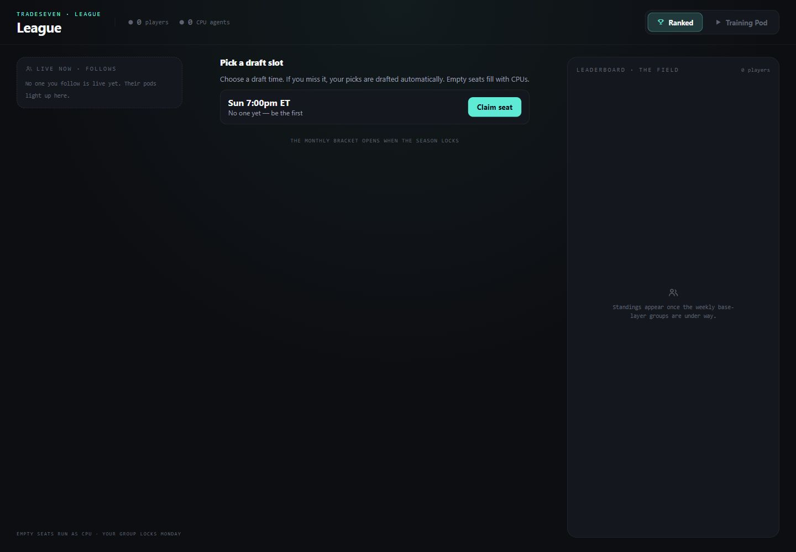
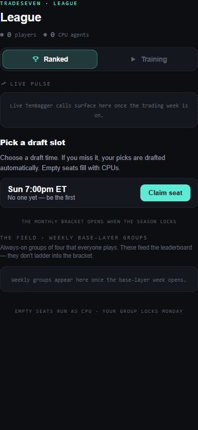
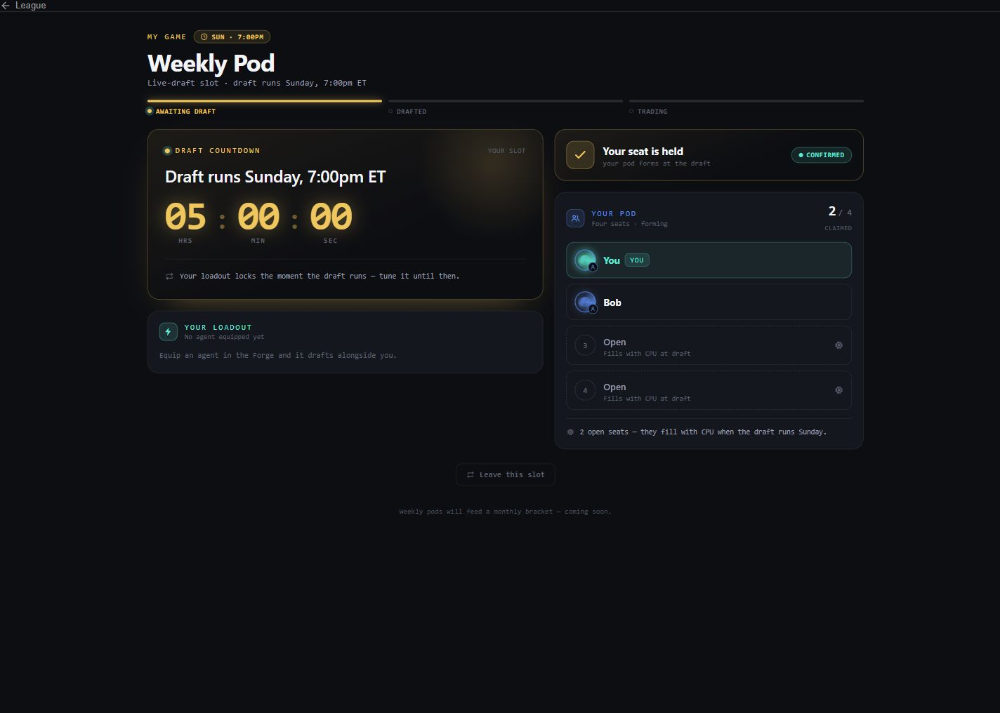
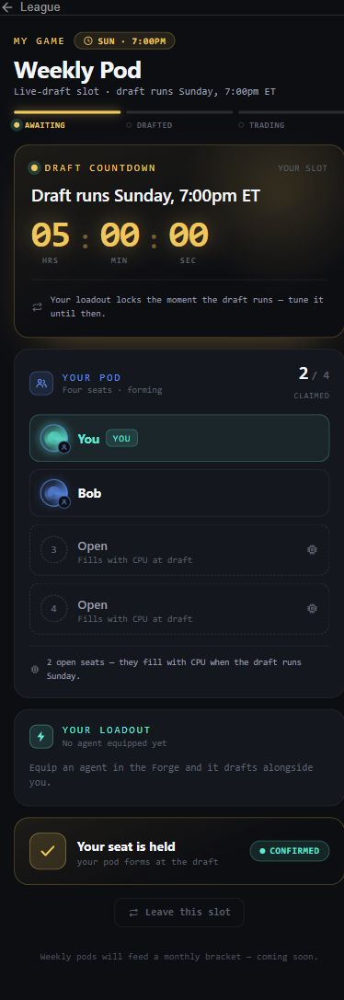
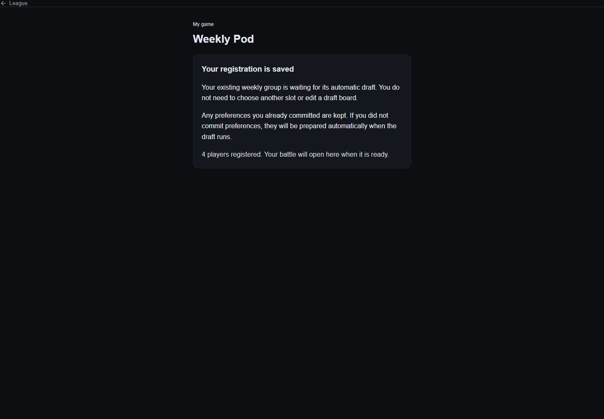
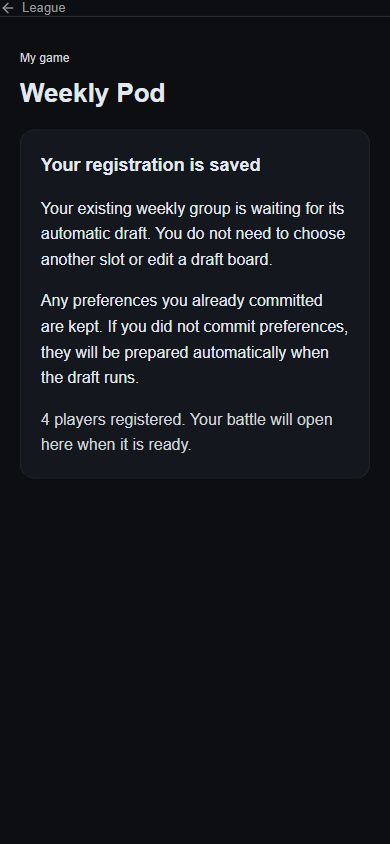

# League scheduled enrollment implementation and review

Date: October 4, 2026. Source: freshly fetched `origin/main` at `23842a837d6027537344d0c9f595c471c55a1c8a`. The initial checkout was clean and detached. Implementation branch: `codex/league-scheduled-enrollment`, cut from that source. `git fetch origin` succeeded after granting access to the shared worktree Git metadata.

| Area | Verdict |
| --- | --- |
| Ranked entry | Implemented: scheduled slots only on desktop, mobile, and the participant fallback. |
| Existing weekly registrations | Implemented: a read-only waiting summary replaces the FORMING preference editor; the existing registration remains authoritative. |
| Scheduled draft and server resolution | Preserved; local lifecycle, manual-pick, abandoned-draft, board auto-commit, and orchestrator tests passed. |
| Focused acceptance | 392 tests passed across 20 files, including 14 new routing cases. |
| Build and lint gate | Passed. |
| Full unit gate | 57 failed, 17,519 passed, 87 skipped; 45 failed files, 819 passed, 6 skipped. Baseline-control details below. Do not describe this as a green full suite. |
| Delivery | Draft PR only. Owner handles merge and release. No deployment or production registration test was performed. |

## Scope and source discovery

`CLAUDE.md`, `docs/BUILD_RULES.md`, the League document reading order, implementation spec, design framework, and baseline discovery document were consulted. No applicable populated `AGENTS.md` was found. The user's explicit request authorized discovery followed by implementation on a fresh branch. The user separately approved isolated reviewer subagents for the cumulative review threshold.

The following findings are **VERIFIED source facts**, re-read at this baseline:

- The redesigned desktop and mobile entry both mount `SlotCenter`: `src/components/League/LeagueLobbyDesktop.jsx:214`, `src/components/League/LeagueLobbyRedesign.jsx:177`. The old Auto-draft component called the ranked `quickPlay` service. The participant fallback also mounted `Tournament/LeagueLobby`, which exposed Quick Play, create, join-code, and matchmaking paths. Its mount is now replaced with `SlotCenter` at `src/screens/LeagueParticipantView.jsx:225`. A production import search found no remaining mount of the old LeagueLobby. Backend lobby actions remain available for existing consumers, including Training.
- The redesign-off front door reaches the same participant view (`src/screens/LeagueScreen.jsx:74`), so removing the old card alone would have left another reachable ranked entry. No `App.jsx` route or enrollment API was added.
- Group construction requires exactly one of `bracketGameId` and `baseLayerWeek`; Training is a separate `isTraining` marker (`src/constants/leagueTournament.js:1701`, `:1718`). The legacy waiting predicate requires FORMING, `isLiveDraft !== true`, `isTraining !== true`, a base week, and no bracket game (`src/screens/LeagueParticipantView.jsx:354`).
- Ranked Quick Play stamps the battle week and creates the existing CPU-padded FORMING group (`api/_utils/tournamentLobbyService.js:361`, `:376`, `:409`). Slot admission checks existing non-training active groups for that same battle week (`api/_utils/liveDraftFormation.js:291`, `:368`). The regular-group rejection is covered at `api/_utils/liveDraftFormation.test.js:480`. This guard was not bypassed or edited.
- The enabled schedule remains Wednesday 7pm, Saturday noon, and Sunday 7pm ET. Monday 8:45am is explicitly disabled (`src/config/liveDraftSlots.js:45`). `LEAGUE_LIVE_DRAFT` remains `true` (`src/config/featureFlags.js:443`). No schedule or flag file changed.

## Resulting behavior

The separate Auto-draft component is removed. `SlotCenter` offers only the scheduled picker while live draft is enabled, and an explicit unavailable message while disabled (`src/components/League/liveDraft/SlotCenter.jsx:34`). The bracket footnote and Backing placement remain.

The picker explains: “Choose a draft time. If you miss it, your picks are drafted automatically.” Loading, empty schedule, full rows, disabled rows, and request errors remain distinct. An error offers “Retry slots”; retry clears the prior error and returns to loading. A confirmed claim invokes the existing navigation callback immediately, so a hanging schedule refresh cannot delay opening the claimed game (`src/components/League/liveDraft/LiveDraftPicker.jsx:31`, `:44`, `:55`, `:59`).

Scheduled FORMING registrations still render the existing `LiveDraftGlimpse` and its `scheduledDraftAt` countdown. DRAFTING still renders the interactive `DraftBoardRoom`; AWAITING_OPEN retains its holding view (`src/screens/LeagueParticipantView.jsx:310`, `:317`, `:340`). Back, “Open my game,” and a component remount representing refresh all return to the same subscription-backed seat and countdown in the executed desktop/mobile routing tests.

Older weekly FORMING registrations instead render `LegacyWeeklyWaiting` (`src/components/League/liveDraft/LegacyWeeklyWaiting.jsx:7`). It has no board subscription, mutation, slot claim, slot release, invented timestamp, or `isLiveDraft` conversion. The summary explains that saved preferences are kept and missing preferences will be prepared automatically. It uses the existing group and returns to the ordinary battle route when the subscribed status reaches BATTLE.

No migration is required by the inspected completion path: the Monday pipeline excludes scheduled groups, tries normal board resolution, auto-commits missing boards, and retries (`api/_utils/tournamentOrchestrator.js:588`, `:638`, `:654`). Existing committed documents are excluded from auto-commit; a race-window committed document also wins in the transaction (`api/_utils/tournamentBoardAutoCommit.js:127`, `:187`). The summary changes none of those inputs.

The server cron independently fires scheduled drafts and drives overdue turns (`api/cron/live-draft-fire.js:60`, `:73`). Executed Node tests complete abandoned one-human and multi-human drafts without a browser, and retain manual-pick behavior (`api/_utils/liveDraftLifecycle.test.js:190`, `:288`, `:303`). The e2e suite explicitly enables the otherwise-disabled Monday slot in its test fixture; it does not change the shipped schedule.

Bracket board handling stays in `BoardCommitFlow`. Training remains excluded from ranked group selection. BATTLE retains the arena route and the classic pre-open claim controls (`src/screens/LeagueParticipantView.jsx:290`, `:383`). No scoring, claims, prices, agent behavior, or backend source changed. No fenced function calls were added by this change and no fenced files were edited.

### Flag off

**VERIFIED locally:** unseated desktop/mobile and participant entry show “Scheduled draft enrollment is unavailable right now. Please check back later.” They do not expose Auto-draft or the old lobby shortcuts. Existing scheduled registrations still render their countdown based on stored group identity. Existing weekly registrations still render their waiting summary.

An inherited limitation remains: flag-off also disables the release endpoint (`api/_utils/liveDraftEndpoint.js:83`, `api/tournament/slot-release.js:18`). A failed leave retains the seat and countdown; the existing participant handler resets the pending state without displaying the error. This task does not change that endpoint or error handler. Successful leaving is verified with the flag on.

## Executed validation

All execution here is local. Auth, Firestore subscriptions, and network services are replaced by fixtures in the UI tests. Backend tests use their existing in-memory data seams. None establishes production reachability, actual registration persistence, cron execution on a hosted environment, or an authenticated browser journey.

| Check | Result |
| --- | --- |
| `npm run build` | Passed; existing bundle-size and browser-data-age warnings. |
| `npm run lint:gate` | Passed, including the final test revision. |
| Focused acceptance command below | 20 files / 392 tests passed. |
| New real-component routing suite | 14 passed; real LeagueScreen, desktop/mobile lobbies, participant router, picker, countdown, legacy summary, and BoardCommitFlow; unrelated battle bodies and data/auth seams mocked. |
| Full `npm run test:run -- --maxWorkers=2` | 45 failed files / 57 failed tests; 819 files / 17,519 tests passed; 6 files / 87 tests skipped. Ran before the review-only test split; the corrected 14-case test then passed in the final focused run. |
| Golden inspection | Only 4 of 12 desktop-dark and 10 of 96 mobile hashes changed, all unseated entry or SlotCenter. Seated and Backing surfaces stayed pinned. |
| `git diff --check` | Passed. |

Focused command:

```text
npm run test:run -- src/screens/LeagueEnrollment.routing.test.jsx src/screens/leagueParticipantFraming.test.js src/screens/leagueTrainingBattleFraming.test.js src/components/League/liveDraft src/components/League/LeagueLobbyDesktop.smoke.test.jsx src/components/League/LeagueLobbyHonest.smoke.test.jsx src/components/League/WhileYouWait.smoke.test.jsx src/components/League/draft/DraftBoardRoom.smoke.test.jsx src/components/League/backing/backingLanding.test.jsx src/components/League/backing/backingMobilePin.test.jsx api/_utils/liveDraftLifecycle.test.js api/_utils/liveDraftLifecycle.e2e.test.js api/_utils/liveDraftFormation.test.js api/_utils/tournamentBoardAutoCommit.test.js api/_utils/tournamentOrchestrator.test.js api/_utils/trainingLifecycle.test.js api/tournament/slot-endpoints.test.js src/utils/roundBoundary.test.js src/utils/roundBoundaryAck.test.js src/config/flagPinGuard.test.js --maxWorkers=2
```

The new tests verify loading/empty/error/disabled/full states and recovery, claim rejection without navigation, successful navigation despite a hanging refresh, slot leaving, both legacy board states without identity changes, BATTLE transition, bracket/Training exclusions, interactive-draft routing, and pre-open claim route preservation. The redesign-off entry is also statically traced through LeagueScreen; its participant target is mounted directly in the routing test rather than changing the module-level redesign constant at runtime.

### Baseline control

An independent reviewer replayed the 45 failing files on an untouched archive of `23842a837d6027537344d0c9f595c471c55a1c8a`. **All 71 branch failure identities reproduced: 57 named test failures and 14 suite-load failures; zero branch-only failures.** The baseline run had 61 failed tests and 427 passes because it additionally hit four 5-second timeouts in Backing tests. Two decisionRecord cases reported different Windows-path errors under the archive path (unsupported ESM URL scheme versus an octal escape in a generated script); their failure identities match and their sources are unchanged. Other differences were absolute paths or grouped suite reporting.

This establishes that the observed full-suite failures are present on this source baseline in the local Windows environment; it does not establish how CI will behave. The [machine-readable baseline comparison](20261004-league-enrollment/baseline-comparison.json) records matching identities, extra baseline timeouts, and diagnostic differences. No unrelated fixes were made. Raw full-suite, baseline-control, focused, build, lint, and reviewer logs are retained in the external session artifacts.

## Independent adversarial review

Two reviewers inspected distinct archive-based snapshots with dependency junctions. Both were read-only on Git and the shared worktree. A third, separate snapshot was then used for mutation checks. Findings were handed to an independent reviewer or the coordinator with instructions to refute them using concrete evidence.

| Candidate finding | Disposition and evidence |
| --- | --- |
| The old ranked shortcut remains reachable through the participant fallback | REFUTED: real mount changed to SlotCenter; no remaining production LeagueLobby importer; direct participant and both lobbies tested. |
| The waiting summary steals bracket, Training, scheduled, or BATTLE routing | REFUTED: strict metadata/status predicate, existing slot ladder first, exclusion and transition controls passed. |
| Existing boards or registrations are orphaned | REFUTED: summary has no reads/writes beyond the supplied group; real auto-commit and orchestrator tests passed; committed docs win in both normal and race-window paths. |
| Scheduled autopicks need the removed client card | REFUTED: unchanged cron/lifecycle source; Node tests complete abandonment without browser execution. |
| One-game-per-battle-week protection was bypassed | REFUTED: unchanged admission guard and executed regular same-week conflict control. |
| Goldens were refreshed beyond the intended entry change | REFUTED: independent old/new comparison found only the 14 specified unseated/SlotCenter rows; consistent SSR/mounted length deltas, no seated changes. |
| The Backing source-text failure was introduced by this task | REFUTED: unchanged baseline/archive bytes contain CRLF; its literal LF regex fails on both and matches after in-memory LF normalization. No unrelated source or assertion was relaxed. |
| New flag-off leaving test asserts an impossible successful endpoint result | CONFIRMED, fixed: independent reviewer executed 10 endpoint tests and confirmed 404 while off. Test split into enabled successful leave and disabled rejection preserving seat. |
| Adjacent comments still claim flag-off retains Auto-draft | CONFIRMED, fixed: desktop/mobile caller comments and token-map description now match the scheduled-only entry. |

Review total: **2 CONFIRMED and fixed, 7 REFUTED**. No introduced runtime blocker was found in the reviewed scope. This is not approval to merge or release.

The separate mutation snapshot first passed all 14 routing tests. **Five mutants were killed; zero survived:** removing legacy waiting failed all four board-state/viewport rows; broadening the legacy predicate failed bracket and Training exclusions; removing the entry flag gate failed both flag-off rows; putting the claim callback behind a hanging schedule refetch failed the callback assertion; hiding pre-open claims failed the route assertion. Each failure was a DOM or callback assertion, not an import/setup error or timeout. The reviewer restored and SHA-256-checked exact source bytes after every mutant.

## Screenshots

Browser captures of static HTML exported from the real-component fixture mounts. Desktop: 1440px; mobile: 390px. These omit the outer App shell, show a single sample scheduled slot, and use a fixed October 4 clock for the countdown. They are not production screenshots. The committed and missing legacy-board fixtures intentionally show the same read-only summary.

| Desktop | Mobile |
| --- | --- |
|  |  |
|  |  |
|  |  |

To regenerate fixture HTML, set `LEAGUE_SCREENSHOT_DIR` to an external output directory and run `src/screens/LeagueEnrollment.routing.test.jsx`. Open the resulting HTML in a browser at the matching viewport for screenshots.

## Changed files

- Runtime: `src/components/League/liveDraft/SlotCenter.jsx`, `LiveDraftPicker.jsx`, new `LegacyWeeklyWaiting.jsx`, deleted `AutoDraftFallback.jsx`, and `src/screens/LeagueParticipantView.jsx`.
- Adjacent comments only: `src/components/League/LeagueLobbyDesktop.jsx`, `LeagueLobbyRedesign.jsx`, `leagueTokens.js`.
- Tests: new `src/screens/LeagueEnrollment.routing.test.jsx`; updated `liveDraft.smoke.test.jsx`, `LeagueLobbyDesktop.smoke.test.jsx`, `LeagueLobbyHonest.smoke.test.jsx`, and `backing/backingLanding.test.jsx`.
- Golden expectations: `backing/__fixtures__/backingDark.golden.json` and `backingMobilePin.golden.json`.
- Review evidence: this report, the baseline comparison JSON, and six JPEGs in `docs/audits/20261004-league-enrollment/`.

No production records, registrations, flags, schedules, backend sources, fenced files, or deployment configuration were changed. Live browser authentication, hosted cron observation, merge, and release remain unexecuted.
